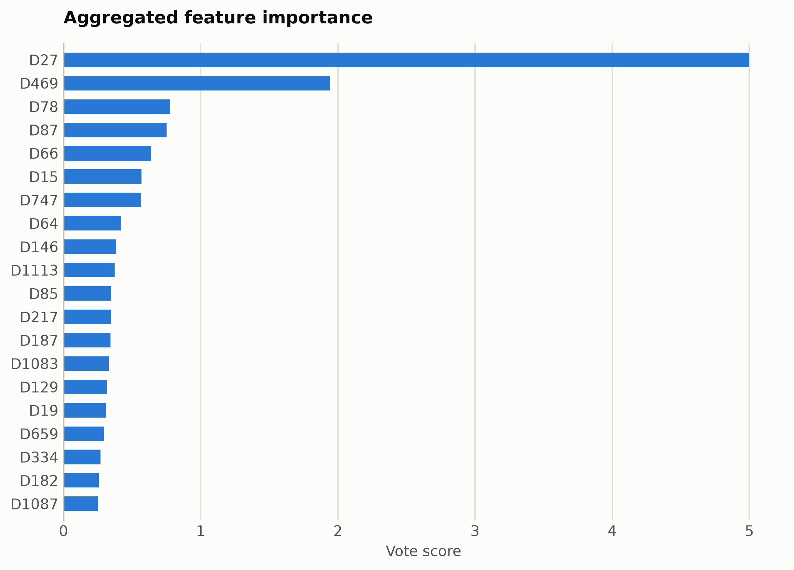
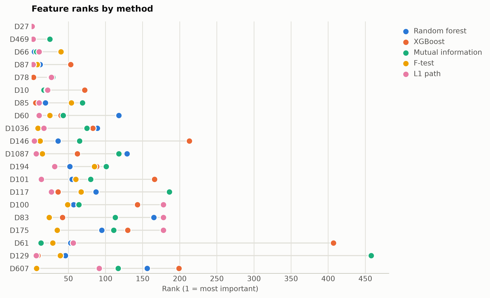

# Molecular bioresponse descriptors

Predicting a biological response from 1,776 molecular descriptors, a wide chemistry matrix.

Data: OpenML Bioresponse (id 4134), 3,751 molecules. 3,751 samples, 1,776 features. One five-method
ensemble ranking of the training split took 196 s and
provides every selector below; reductions fit on the same split. Three
standardized probes (accuracy: linear, kNN, RBF SVM) score the held-out
20%. Budgets anchor at the 99%-variance PCA count x = 819, stepping
x, x/2, x/4, 10, 1.

## Consensus ranking

| feature | score |
|---|---|
| D27 | 5 |
| D469 | 1.94 |
| D78 | 0.7766 |
| D87 | 0.7522 |
| D66 | 0.6381 |
| D15 | 0.5685 |
| D747 | 0.5662 |
| D64 | 0.42 |
| D146 | 0.3812 |
| D1113 | 0.3716 |

## Ablation: selectors vs reductions (accuracy)

`select:<method>` keeps that method's top-k raw features
(`select:vote` is the ensemble); `dr:<method>` is a fitted reduction to
the same k.

| k | representation | linear | knn | svm |
|---|---|---|---|---|
| 1776 | all features | 0.731 | 0.735 | 0.7643 |
| 819 | dr:PCA | 0.7284 | 0.6724 | 0.7537 |
| 819 | dr:RandProj | 0.7417 | 0.7364 | 0.7723 |
| 819 | select:f_test | 0.7284 | 0.7523 | 0.771 |
| 819 | select:l1 | 0.7337 | 0.735 | 0.7723 |
| 819 | select:mi | 0.719 | 0.767 | 0.767 |
| 819 | select:rf | 0.7244 | 0.751 | 0.775 |
| 819 | select:vote | 0.7164 | 0.755 | 0.7776 |
| 819 | select:xg | 0.7337 | 0.743 | 0.7763 |
| 409 | dr:PCA | 0.731 | 0.6897 | 0.7723 |
| 409 | dr:RandProj | 0.7137 | 0.7443 | 0.7683 |
| 409 | select:f_test | 0.735 | 0.7457 | 0.7643 |
| 409 | select:l1 | 0.731 | 0.739 | 0.7603 |
| 409 | select:mi | 0.7337 | 0.7563 | 0.7723 |
| 409 | select:rf | 0.7523 | 0.7403 | 0.7816 |
| 409 | select:vote | 0.7443 | 0.7643 | 0.771 |
| 409 | select:xg | 0.735 | 0.747 | 0.779 |
| 204 | dr:PCA | 0.747 | 0.7257 | 0.7617 |
| 204 | dr:RandProj | 0.7004 | 0.7364 | 0.7497 |
| 204 | select:f_test | 0.7364 | 0.743 | 0.7656 |
| 204 | select:l1 | 0.751 | 0.759 | 0.7736 |
| 204 | select:mi | 0.723 | 0.7403 | 0.7736 |
| 204 | select:rf | 0.7457 | 0.7643 | 0.7776 |
| 204 | select:vote | 0.747 | 0.767 | 0.7696 |
| 204 | select:xg | 0.7257 | 0.7457 | 0.763 |
| 10 | dr:ICA | 0.6418 | 0.7217 | 0.6791 |
| 10 | dr:Isomap | 0.5885 | 0.6831 | 0.6738 |
| 10 | dr:KernelPCA | 0.6471 | 0.7044 | 0.7004 |
| 10 | dr:PCA | 0.6418 | 0.723 | 0.6791 |
| 10 | dr:RandProj | 0.5672 | 0.6205 | 0.6005 |
| 10 | dr:UMAP | 0.5752 | 0.7057 | 0.6605 |
| 10 | dr:t-SNE | 0.5885 | 0.715 | 0.7017 |
| 10 | select:f_test | 0.7204 | 0.727 | 0.731 |
| 10 | select:l1 | 0.7324 | 0.7257 | 0.7364 |
| 10 | select:mi | 0.7137 | 0.735 | 0.727 |
| 10 | select:rf | 0.7177 | 0.7324 | 0.7337 |
| 10 | select:vote | 0.7297 | 0.7377 | 0.7403 |
| 10 | select:xg | 0.735 | 0.719 | 0.7337 |
| 1 | dr:ICA | 0.5419 | 0.534 | 0.5646 |
| 1 | dr:Isomap | 0.5419 | 0.494 | 0.5433 |
| 1 | dr:KernelPCA | 0.5419 | 0.5286 | 0.5473 |
| 1 | dr:PCA | 0.5419 | 0.534 | 0.5646 |
| 1 | dr:RandProj | 0.5433 | 0.494 | 0.5433 |
| 1 | dr:UMAP | 0.522 | 0.6738 | 0.6072 |
| 1 | dr:t-SNE | 0.6072 | 0.6671 | 0.6045 |
| 1 | select:f_test | 0.7124 | 0.7124 | 0.7124 |
| 1 | select:l1 | 0.7124 | 0.7124 | 0.7124 |
| 1 | select:mi | 0.7124 | 0.7124 | 0.7124 |
| 1 | select:rf | 0.7124 | 0.7124 | 0.7124 |
| 1 | select:vote | 0.7124 | 0.7124 | 0.7124 |
| 1 | select:xg | 0.7124 | 0.7124 | 0.7124 |

Notes: t-SNE has no out-of-sample transform, so it is fit on all rows
(label-blind) and split afterward, which favors it mildly; UMAP, kernel
PCA, Isomap, and ICA run at budgets up to 100 and t-SNE up to
10, beyond which their cost is impractical, while selection has
no budget ceiling. Cross-dataset findings: [the research report](report.md).

Regenerate with `python examples/selection_vs_reduction.py --name bioresponse`.
