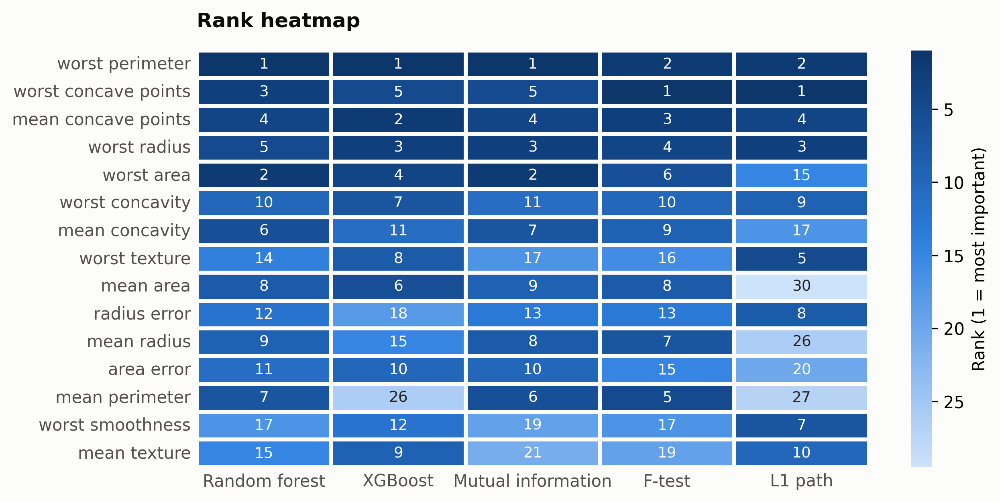

# Breast cancer classification

The scikit-learn breast cancer dataset: 569 tumors,
30 named morphology features, binary malignancy label. The
full five-method ensemble ran in 11 s
(rf 8 s, xg 2 s, l1 1.3 s,
mi 0.1 s, f_test 0.00 s).

```python
from sklearn.datasets import load_breast_cancer
from featureranker import feature_ranking, voting

data = load_breast_cancer(as_frame=True)
result = feature_ranking(data.data, data.target, task="classification")
vote_table = voting(result)
```

## Consensus

| feature | score |
|---|---|
| worst perimeter | 4 |
| worst concave points | 2.733 |
| mean concave points | 1.583 |
| worst area | 1.483 |
| worst radius | 1.45 |
| mean perimeter | 0.585 |
| mean concavity | 0.5704 |
| mean area | 0.5617 |
| worst concavity | 0.5449 |
| worst texture | 0.5178 |


## Where the methods agree and disagree

The dot plot shows each method's rank per feature; tight rows are consensus,
spread rows are disagreement (the L1 path disagrees with the tree models
about `mean area`, which is nearly collinear with `worst area`):




Regenerate this page and its images with `python examples/breast_cancer.py`.
