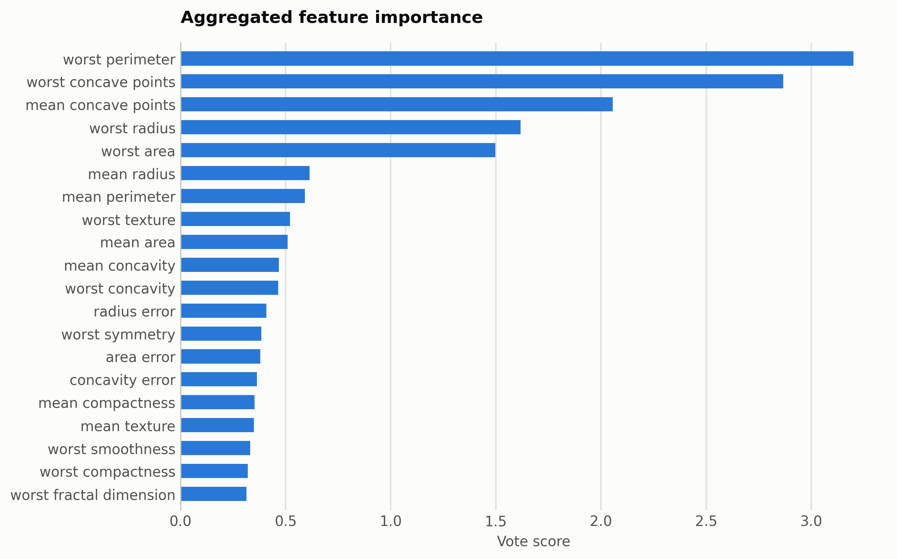
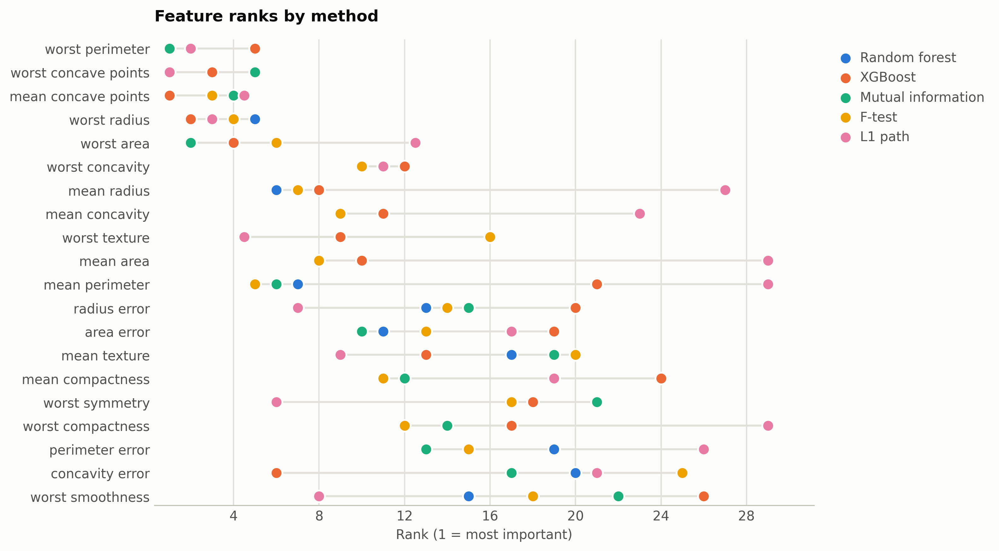

# Breast cancer morphology

The classic tabular case: 30 named tumor morphology features and a binary malignancy label.

Data: scikit-learn breast cancer dataset. 569 samples, 30 features. One five-method
ensemble ranking of the training split took 10 s and
provides every selector below; reductions fit on the same split. Three
standardized probes (accuracy: linear, kNN, RBF SVM) score the held-out
20%. Budgets anchor at the 99%-variance PCA count x = 17, stepping
x, x/2, x/4, 10, 1.

## Consensus ranking

| feature | score |
|---|---|
| worst perimeter | 3.2 |
| worst concave points | 2.867 |
| mean concave points | 2.056 |
| worst radius | 1.617 |
| worst area | 1.497 |
| mean radius | 0.6144 |
| mean perimeter | 0.5916 |
| worst texture | 0.5208 |
| mean area | 0.5095 |
| mean concavity | 0.4677 |

## Ablation: selectors vs reductions (accuracy)

`select:<method>` keeps that method's top-k raw features
(`select:vote` is the ensemble); `dr:<method>` is a fitted reduction to
the same k.

| k | representation | linear | knn | svm |
|---|---|---|---|---|
| 30 | all features | 0.9825 | 0.9649 | 0.9825 |
| 17 | dr:ICA | 0.9737 | 0.886 | 0.9649 |
| 17 | dr:Isomap | 0.9649 | 0.9035 | 0.9561 |
| 17 | dr:KernelPCA | 0.9649 | 0.9825 | 0.9649 |
| 17 | dr:PCA | 0.9737 | 0.886 | 0.9649 |
| 17 | dr:RandProj | 0.9825 | 0.9649 | 0.9737 |
| 17 | dr:UMAP | 0.9474 | 0.9474 | 0.9561 |
| 17 | select:f_test | 0.9561 | 0.9474 | 0.9649 |
| 17 | select:l1 | 0.9912 | 0.9737 | 0.9825 |
| 17 | select:mi | 0.9737 | 0.9474 | 0.9649 |
| 17 | select:rf | 0.9737 | 0.9561 | 0.9649 |
| 17 | select:vote | 0.9561 | 0.9474 | 0.9649 |
| 17 | select:xg | 0.9649 | 0.9298 | 0.9737 |
| 10 | dr:ICA | 0.9737 | 0.9474 | 0.9474 |
| 10 | dr:Isomap | 0.9649 | 0.9035 | 0.9649 |
| 10 | dr:KernelPCA | 0.9561 | 0.9474 | 0.9561 |
| 10 | dr:PCA | 0.9737 | 0.9474 | 0.9474 |
| 10 | dr:RandProj | 0.9825 | 0.9561 | 0.9561 |
| 10 | dr:UMAP | 0.9474 | 0.9561 | 0.9649 |
| 10 | dr:t-SNE | 0.886 | 0.9211 | 0.9298 |
| 10 | select:f_test | 0.9474 | 0.9298 | 0.9561 |
| 10 | select:l1 | 0.9825 | 0.9561 | 0.9474 |
| 10 | select:mi | 0.9561 | 0.9474 | 0.9649 |
| 10 | select:rf | 0.9474 | 0.9298 | 0.9561 |
| 10 | select:vote | 0.9386 | 0.9386 | 0.9386 |
| 10 | select:xg | 0.9386 | 0.9386 | 0.9386 |
| 8 | dr:ICA | 0.9649 | 0.9211 | 0.9298 |
| 8 | dr:Isomap | 0.9649 | 0.8772 | 0.9561 |
| 8 | dr:KernelPCA | 0.9649 | 0.9298 | 0.9386 |
| 8 | dr:PCA | 0.9649 | 0.9211 | 0.9298 |
| 8 | dr:RandProj | 0.9474 | 0.9298 | 0.9474 |
| 8 | dr:UMAP | 0.9474 | 0.9386 | 0.9474 |
| 8 | dr:t-SNE | 0.9035 | 0.9035 | 0.9298 |
| 8 | select:f_test | 0.9474 | 0.9474 | 0.9474 |
| 8 | select:l1 | 0.9737 | 0.9737 | 0.9649 |
| 8 | select:mi | 0.9474 | 0.9474 | 0.9474 |
| 8 | select:rf | 0.9474 | 0.9474 | 0.9474 |
| 8 | select:vote | 0.9386 | 0.9386 | 0.9386 |
| 8 | select:xg | 0.9298 | 0.9649 | 0.9737 |
| 4 | dr:ICA | 0.9649 | 0.9211 | 0.9386 |
| 4 | dr:Isomap | 0.9561 | 0.9298 | 0.9298 |
| 4 | dr:KernelPCA | 0.9386 | 0.886 | 0.9211 |
| 4 | dr:PCA | 0.9649 | 0.9211 | 0.9386 |
| 4 | dr:RandProj | 0.8333 | 0.807 | 0.8509 |
| 4 | dr:UMAP | 0.9561 | 0.9649 | 0.9649 |
| 4 | dr:t-SNE | 0.9211 | 0.9035 | 0.9298 |
| 4 | select:f_test | 0.9298 | 0.9298 | 0.9298 |
| 4 | select:l1 | 0.9298 | 0.9298 | 0.9298 |
| 4 | select:mi | 0.9474 | 0.9386 | 0.9386 |
| 4 | select:rf | 0.9386 | 0.9298 | 0.9298 |
| 4 | select:vote | 0.9298 | 0.9298 | 0.9298 |
| 4 | select:xg | 0.9298 | 0.9474 | 0.9298 |
| 1 | dr:ICA | 0.9123 | 0.8772 | 0.9123 |
| 1 | dr:Isomap | 0.9386 | 0.9123 | 0.9298 |
| 1 | dr:KernelPCA | 0.8947 | 0.8947 | 0.886 |
| 1 | dr:PCA | 0.9123 | 0.8772 | 0.9123 |
| 1 | dr:RandProj | 0.6404 | 0.5614 | 0.6579 |
| 1 | dr:UMAP | 0.9123 | 0.9035 | 0.9211 |
| 1 | dr:t-SNE | 0.9211 | 0.9561 | 0.9211 |
| 1 | select:f_test | 0.9123 | 0.886 | 0.9123 |
| 1 | select:l1 | 0.9123 | 0.886 | 0.9123 |
| 1 | select:mi | 0.9211 | 0.9035 | 0.9123 |
| 1 | select:rf | 0.9211 | 0.9035 | 0.9123 |
| 1 | select:vote | 0.9211 | 0.9035 | 0.9123 |
| 1 | select:xg | 0.9298 | 0.9035 | 0.9123 |

Notes: t-SNE has no out-of-sample transform, so it is fit on all rows
(label-blind) and split afterward, which favors it mildly; UMAP, kernel
PCA, Isomap, and ICA run at budgets up to 100 and t-SNE up to
10, beyond which their cost is impractical, while selection has
no budget ceiling. Cross-dataset findings: [the research report](report.md).

Regenerate with `python examples/selection_vs_reduction.py --name breast_cancer`.
