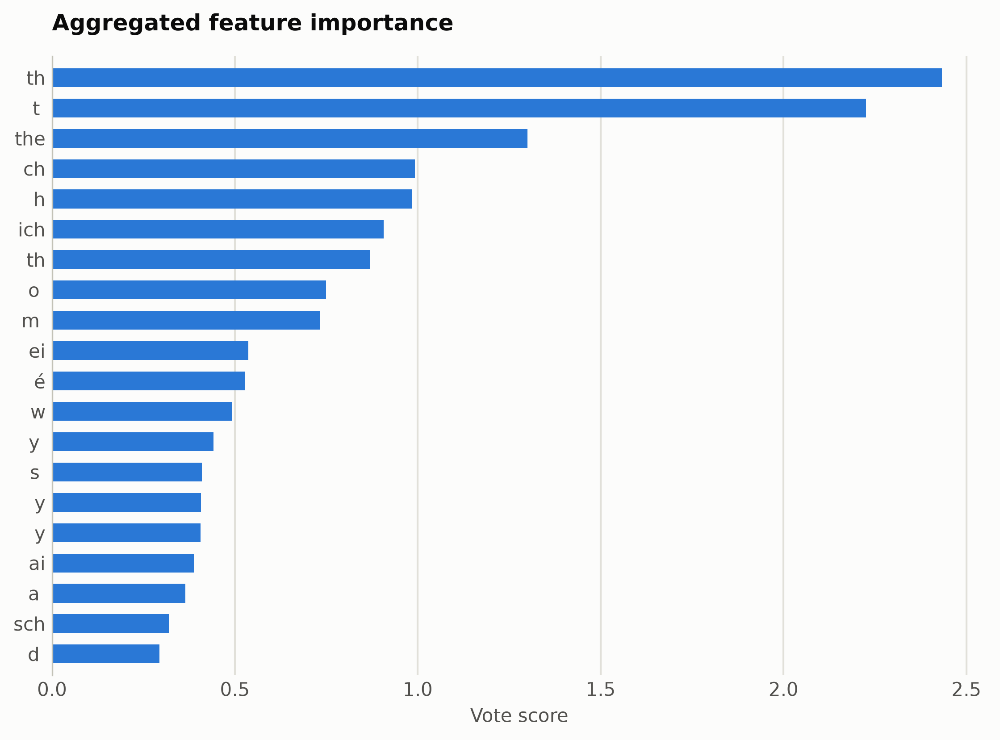
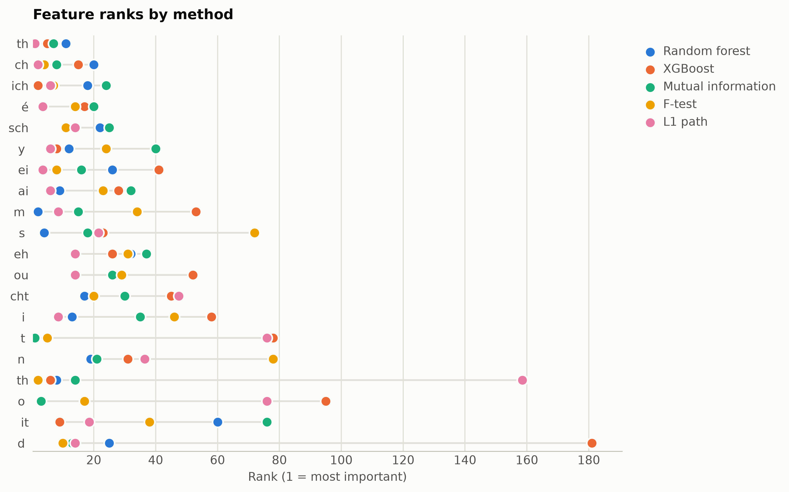

# Language identification from character n-grams

Six European languages from character 1-3 gram TF-IDF (top 2,000 n-grams), the classical language-ID recipe.

Data: papluca/language-identification, 6 languages x 600 texts. 3,600 samples, 2,000 features. One five-method
ensemble ranking of the training split took 2885 s and
provides every selector below; reductions fit on the same split. Three
standardized probes (accuracy: linear, kNN, RBF SVM) score the held-out
20%. Budgets anchor at the 99%-variance PCA count x = 1395, stepping
x, x/2, x/4, 10, 1.

## Consensus ranking

| feature | score |
|---|---|
| th | 2.434 |
| t  | 2.226 |
| the | 1.301 |
| ch | 0.9917 |
| h | 0.9831 |
| ich | 0.9067 |
|  th | 0.8694 |
| o  | 0.7492 |
| m  | 0.7326 |
| ei | 0.5361 |

## Ablation: selectors vs reductions (accuracy)

`select:<method>` keeps that method's top-k raw features
(`select:vote` is the ensemble); `dr:<method>` is a fitted reduction to
the same k.

| k | representation | linear | knn | svm |
|---|---|---|---|---|
| 2000 | all features | 0.9958 | 0.7986 | 0.9944 |
| 1395 | dr:PCA | 0.9847 | 0.2028 | 0.7111 |
| 1395 | dr:RandProj | 0.9917 | 0.8042 | 0.9875 |
| 1395 | select:f_test | 0.9958 | 0.9292 | 0.9889 |
| 1395 | select:l1 | 0.9958 | 0.9 | 0.9958 |
| 1395 | select:mi | 0.9958 | 0.8903 | 0.9944 |
| 1395 | select:rf | 0.9958 | 0.8028 | 0.9972 |
| 1395 | select:vote | 0.9944 | 0.8889 | 0.9917 |
| 1395 | select:xg | 0.9944 | 0.8292 | 0.9931 |
| 697 | dr:PCA | 0.9903 | 0.5528 | 0.9931 |
| 697 | dr:RandProj | 0.9861 | 0.7986 | 0.9819 |
| 697 | select:f_test | 0.9917 | 0.975 | 0.9875 |
| 697 | select:l1 | 0.9944 | 0.9764 | 0.9917 |
| 697 | select:mi | 0.9958 | 0.9681 | 0.9931 |
| 697 | select:rf | 0.9958 | 0.9528 | 0.9972 |
| 697 | select:vote | 0.9944 | 0.9708 | 0.9972 |
| 697 | select:xg | 0.9944 | 0.9167 | 0.9944 |
| 348 | dr:PCA | 0.9931 | 0.7125 | 0.9917 |
| 348 | dr:RandProj | 0.9639 | 0.8 | 0.975 |
| 348 | select:f_test | 0.9875 | 0.9639 | 0.9931 |
| 348 | select:l1 | 0.9931 | 0.9792 | 0.9875 |
| 348 | select:mi | 0.9833 | 0.9611 | 0.9958 |
| 348 | select:rf | 0.9875 | 0.975 | 0.9903 |
| 348 | select:vote | 0.9903 | 0.9778 | 0.9903 |
| 348 | select:xg | 0.9847 | 0.975 | 0.9875 |
| 10 | dr:ICA | 0.9931 | 0.9903 | 0.9917 |
| 10 | dr:Isomap | 0.8583 | 0.8389 | 0.8514 |
| 10 | dr:KernelPCA | 0.9917 | 0.9903 | 0.9903 |
| 10 | dr:PCA | 0.9944 | 0.9889 | 0.9931 |
| 10 | dr:RandProj | 0.4278 | 0.4083 | 0.4403 |
| 10 | dr:UMAP | 0.9417 | 0.9181 | 0.9333 |
| 10 | dr:t-SNE | 0.8472 | 0.8944 | 0.9042 |
| 10 | select:f_test | 0.6778 | 0.6778 | 0.7167 |
| 10 | select:l1 | 0.8139 | 0.8153 | 0.8042 |
| 10 | select:mi | 0.7639 | 0.7444 | 0.7542 |
| 10 | select:rf | 0.8625 | 0.8278 | 0.8569 |
| 10 | select:vote | 0.7361 | 0.7569 | 0.7333 |
| 10 | select:xg | 0.6208 | 0.5514 | 0.6278 |
| 1 | dr:ICA | 0.6222 | 0.6125 | 0.6264 |
| 1 | dr:Isomap | 0.7319 | 0.7306 | 0.6903 |
| 1 | dr:KernelPCA | 0.3528 | 0.3222 | 0.3778 |
| 1 | dr:PCA | 0.6222 | 0.6125 | 0.6264 |
| 1 | dr:RandProj | 0.2153 | 0.2139 | 0.2319 |
| 1 | dr:UMAP | 0.6806 | 0.8347 | 0.7764 |
| 1 | dr:t-SNE | 0.7069 | 0.9403 | 0.9333 |
| 1 | select:f_test | 0.3139 | 0.3153 | 0.3139 |
| 1 | select:l1 | 0.3139 | 0.3153 | 0.3139 |
| 1 | select:mi | 0.3431 | 0.3319 | 0.3472 |
| 1 | select:rf | 0.3431 | 0.3319 | 0.3472 |
| 1 | select:vote | 0.3139 | 0.3153 | 0.3139 |
| 1 | select:xg | 0.2861 | 0.2875 | 0.2861 |

Notes: t-SNE has no out-of-sample transform, so it is fit on all rows
(label-blind) and split afterward, which favors it mildly; UMAP, kernel
PCA, Isomap, and ICA run at budgets up to 100 and t-SNE up to
10, beyond which their cost is impractical, while selection has
no budget ceiling. Cross-dataset findings: [the research report](report.md).

Regenerate with `python examples/selection_vs_reduction.py --name chargram_langid`.
