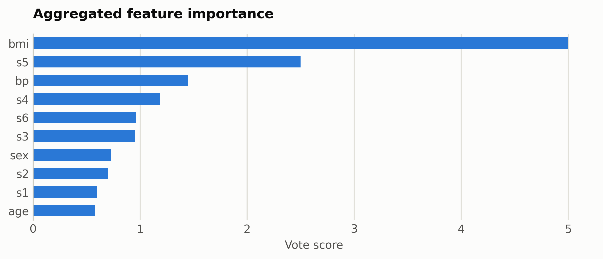
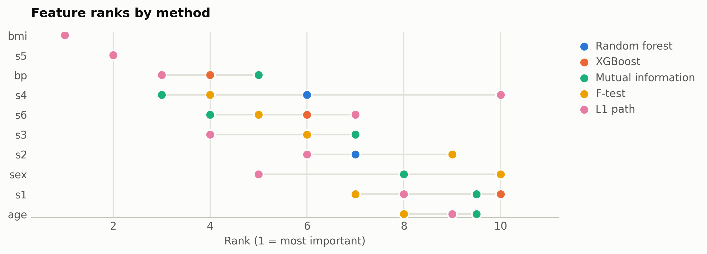

# Diabetes progression

Ten standardized clinical features against a continuous disease-progression target; the probe metric is R2.

Data: scikit-learn diabetes dataset. 442 samples, 10 features. One five-method
ensemble ranking of the training split took 10 s and
provides every selector below; reductions fit on the same split. Three
standardized probes (R2: linear, kNN, RBF SVM) score the held-out
20%. Budgets anchor at the 99%-variance PCA count x = 8, stepping
x, x/2, x/4, 10, 1.

## Consensus ranking

| feature | score |
|---|---|
| bmi | 5 |
| s5 | 2.5 |
| bp | 1.45 |
| s4 | 1.183 |
| s6 | 0.9595 |
| s3 | 0.9524 |
| sex | 0.725 |
| s2 | 0.6984 |
| s1 | 0.5981 |
| age | 0.5775 |

## Ablation: selectors vs reductions (R2)

`select:<method>` keeps that method's top-k raw features
(`select:vote` is the ensemble); `dr:<method>` is a fitted reduction to
the same k.

| k | representation | linear | knn | svm |
|---|---|---|---|---|
| 10 | all features | 0.4541 | 0.402 | 0.1822 |
| 10 | dr:ICA | 0.4529 | 0.4218 | 0.1039 |
| 10 | dr:Isomap | 0.4563 | 0.3634 | 0.1242 |
| 10 | dr:KernelPCA | 0.4394 | 0.4077 | 0.1224 |
| 10 | dr:PCA | 0.4529 | 0.4218 | 0.1039 |
| 10 | dr:UMAP | 0.2778 | 0.2704 | 0.1247 |
| 10 | dr:t-SNE | 0.1644 | 0.3215 | 0.1035 |
| 10 | select:f_test | 0.4541 | 0.402 | 0.1822 |
| 10 | select:l1 | 0.4541 | 0.402 | 0.1822 |
| 10 | select:mi | 0.4541 | 0.402 | 0.1822 |
| 10 | select:rf | 0.4541 | 0.402 | 0.1822 |
| 10 | select:vote | 0.4541 | 0.402 | 0.1822 |
| 10 | select:xg | 0.4541 | 0.402 | 0.1822 |
| 8 | dr:ICA | 0.456 | 0.4269 | 0.1164 |
| 8 | dr:Isomap | 0.4561 | 0.363 | 0.141 |
| 8 | dr:KernelPCA | 0.4352 | 0.3852 | 0.1452 |
| 8 | dr:PCA | 0.456 | 0.4269 | 0.1164 |
| 8 | dr:RandProj | 0.4494 | 0.2265 | 0.1337 |
| 8 | dr:UMAP | 0.3523 | 0.2979 | 0.1842 |
| 8 | dr:t-SNE | 0.1704 | 0.4646 | 0.0919 |
| 8 | select:f_test | 0.4393 | 0.4208 | 0.2104 |
| 8 | select:l1 | 0.4665 | 0.4565 | 0.1971 |
| 8 | select:mi | 0.4642 | 0.4679 | 0.202 |
| 8 | select:rf | 0.4389 | 0.4212 | 0.2104 |
| 8 | select:vote | 0.4642 | 0.4679 | 0.202 |
| 8 | select:xg | 0.4692 | 0.4832 | 0.2064 |
| 4 | dr:ICA | 0.4576 | 0.4397 | 0.2169 |
| 4 | dr:Isomap | 0.4323 | 0.4036 | 0.2143 |
| 4 | dr:KernelPCA | 0.4523 | 0.4 | 0.2106 |
| 4 | dr:PCA | 0.4576 | 0.4397 | 0.2169 |
| 4 | dr:RandProj | 0.2505 | 0.1845 | 0.1662 |
| 4 | dr:UMAP | 0.2691 | 0.2959 | 0.21 |
| 4 | dr:t-SNE | 0.0677 | 0.3607 | 0.1013 |
| 4 | select:f_test | 0.4527 | 0.3953 | 0.2904 |
| 4 | select:l1 | 0.4472 | 0.4298 | 0.2755 |
| 4 | select:mi | 0.4547 | 0.4602 | 0.2603 |
| 4 | select:rf | 0.4472 | 0.4298 | 0.2755 |
| 4 | select:vote | 0.4527 | 0.3953 | 0.2904 |
| 4 | select:xg | 0.4527 | 0.3953 | 0.2904 |
| 2 | dr:ICA | 0.3406 | 0.2421 | 0.194 |
| 2 | dr:Isomap | 0.3501 | 0.3582 | 0.2595 |
| 2 | dr:KernelPCA | 0.2859 | 0.2172 | 0.2095 |
| 2 | dr:PCA | 0.3406 | 0.2421 | 0.194 |
| 2 | dr:RandProj | 0.1202 | 0.1002 | 0.1226 |
| 2 | dr:UMAP | 0.1426 | 0.3741 | 0.1426 |
| 2 | dr:t-SNE | 0.1323 | 0.3867 | 0.1342 |
| 2 | select:f_test | 0.4524 | 0.4248 | 0.3161 |
| 2 | select:l1 | 0.4524 | 0.4248 | 0.3161 |
| 2 | select:mi | 0.4524 | 0.4248 | 0.3161 |
| 2 | select:rf | 0.4524 | 0.4248 | 0.3161 |
| 2 | select:vote | 0.4524 | 0.4248 | 0.3161 |
| 2 | select:xg | 0.4524 | 0.4248 | 0.3161 |
| 1 | dr:ICA | 0.3258 | 0.2074 | 0.2255 |
| 1 | dr:Isomap | 0.0539 | 0.0834 | 0.0479 |
| 1 | dr:KernelPCA | 0.2444 | 0.1968 | 0.1974 |
| 1 | dr:PCA | 0.3258 | 0.2074 | 0.2255 |
| 1 | dr:RandProj | 0.0078 | 0.0021 | 0.0638 |
| 1 | dr:UMAP | 0.0167 | 0.2725 | 0.0819 |
| 1 | dr:t-SNE | 0.1461 | 0.3616 | 0.1281 |
| 1 | select:f_test | 0.2339 | 0.1924 | 0.1966 |
| 1 | select:l1 | 0.2339 | 0.1924 | 0.1966 |
| 1 | select:mi | 0.2339 | 0.1924 | 0.1966 |
| 1 | select:rf | 0.2339 | 0.1924 | 0.1966 |
| 1 | select:vote | 0.2339 | 0.1924 | 0.1966 |
| 1 | select:xg | 0.2339 | 0.1924 | 0.1966 |

Notes: t-SNE has no out-of-sample transform, so it is fit on all rows
(label-blind) and split afterward, which favors it mildly; UMAP, kernel
PCA, Isomap, and ICA run at budgets up to 100 and t-SNE up to
10, beyond which their cost is impractical, while selection has
no budget ceiling. Cross-dataset findings: [the research report](report.md).

Regenerate with `python examples/selection_vs_reduction.py --name diabetes`.
