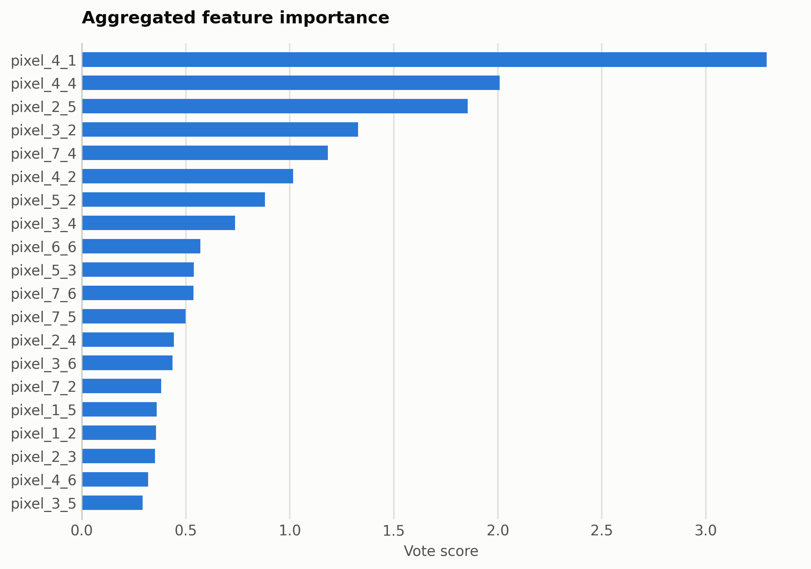
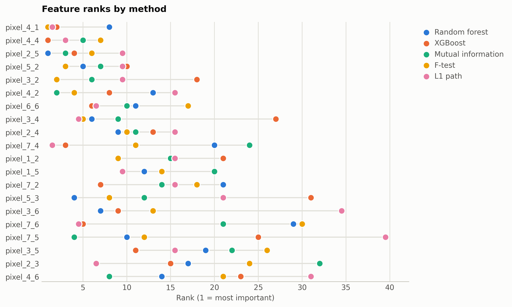

# Handwritten digits from raw pixels

8x8 grayscale digits with each pixel as a named feature, so the ranking is a spatial saliency map.

Data: scikit-learn digits dataset, 1,797 images. 1,797 samples, 64 features. One five-method
ensemble ranking of the training split took 123 s and
provides every selector below; reductions fit on the same split. Three
standardized probes (accuracy: linear, kNN, RBF SVM) score the held-out
20%. Budgets anchor at the 99%-variance PCA count x = 54, stepping
x, x/2, x/4, 10, 1.

## Consensus ranking

| feature | score |
|---|---|
| pixel_4_1 | 3.292 |
| pixel_4_4 | 2.01 |
| pixel_2_5 | 1.855 |
| pixel_3_2 | 1.327 |
| pixel_7_4 | 1.183 |
| pixel_4_2 | 1.016 |
| pixel_5_2 | 0.8815 |
| pixel_3_4 | 0.737 |
| pixel_6_6 | 0.5702 |
| pixel_5_3 | 0.5382 |

## Ablation: selectors vs reductions (accuracy)

`select:<method>` keeps that method's top-k raw features
(`select:vote` is the ensemble); `dr:<method>` is a fitted reduction to
the same k.

| k | representation | linear | knn | svm |
|---|---|---|---|---|
| 64 | all features | 0.9722 | 0.9611 | 0.975 |
| 54 | dr:ICA | 0.9639 | 0.9389 | 0.9722 |
| 54 | dr:Isomap | 0.9472 | 0.9083 | 0.95 |
| 54 | dr:KernelPCA | 0.9667 | 0.9611 | 0.9722 |
| 54 | dr:PCA | 0.9639 | 0.9389 | 0.9722 |
| 54 | dr:RandProj | 0.9444 | 0.9472 | 0.9722 |
| 54 | dr:UMAP | 0.9583 | 0.95 | 0.9333 |
| 54 | select:f_test | 0.9722 | 0.9611 | 0.9833 |
| 54 | select:l1 | 0.9722 | 0.9639 | 0.9833 |
| 54 | select:mi | 0.9722 | 0.9667 | 0.9833 |
| 54 | select:rf | 0.9722 | 0.9611 | 0.9833 |
| 54 | select:vote | 0.9722 | 0.9611 | 0.9861 |
| 54 | select:xg | 0.9694 | 0.9667 | 0.9833 |
| 27 | dr:ICA | 0.9417 | 0.9611 | 0.9722 |
| 27 | dr:Isomap | 0.95 | 0.925 | 0.9389 |
| 27 | dr:KernelPCA | 0.9583 | 0.9556 | 0.9722 |
| 27 | dr:PCA | 0.9444 | 0.9528 | 0.9722 |
| 27 | dr:RandProj | 0.9056 | 0.9083 | 0.9556 |
| 27 | dr:UMAP | 0.9472 | 0.9583 | 0.9556 |
| 27 | select:f_test | 0.9361 | 0.9694 | 0.9833 |
| 27 | select:l1 | 0.9361 | 0.9694 | 0.9889 |
| 27 | select:mi | 0.9528 | 0.9722 | 0.9917 |
| 27 | select:rf | 0.9333 | 0.9778 | 0.9889 |
| 27 | select:vote | 0.9417 | 0.9667 | 0.9806 |
| 27 | select:xg | 0.9083 | 0.9611 | 0.975 |
| 13 | dr:ICA | 0.9 | 0.9472 | 0.9583 |
| 13 | dr:Isomap | 0.9444 | 0.9278 | 0.9417 |
| 13 | dr:KernelPCA | 0.95 | 0.9472 | 0.9667 |
| 13 | dr:PCA | 0.9 | 0.9472 | 0.9583 |
| 13 | dr:RandProj | 0.8194 | 0.8556 | 0.8806 |
| 13 | dr:UMAP | 0.9278 | 0.9556 | 0.9417 |
| 13 | select:f_test | 0.8778 | 0.9361 | 0.9389 |
| 13 | select:l1 | 0.8639 | 0.8917 | 0.9194 |
| 13 | select:mi | 0.875 | 0.9222 | 0.9278 |
| 13 | select:rf | 0.8722 | 0.9111 | 0.9389 |
| 13 | select:vote | 0.8611 | 0.9111 | 0.9333 |
| 13 | select:xg | 0.8389 | 0.9111 | 0.9083 |
| 10 | dr:ICA | 0.8722 | 0.9056 | 0.9444 |
| 10 | dr:Isomap | 0.95 | 0.9361 | 0.9472 |
| 10 | dr:KernelPCA | 0.8944 | 0.9194 | 0.9333 |
| 10 | dr:PCA | 0.8722 | 0.9056 | 0.9444 |
| 10 | dr:RandProj | 0.7222 | 0.7833 | 0.8361 |
| 10 | dr:UMAP | 0.925 | 0.9556 | 0.9444 |
| 10 | dr:t-SNE | 0.9194 | 0.9639 | 0.9694 |
| 10 | select:f_test | 0.8444 | 0.9028 | 0.9306 |
| 10 | select:l1 | 0.8028 | 0.8389 | 0.8528 |
| 10 | select:mi | 0.8028 | 0.8444 | 0.8583 |
| 10 | select:rf | 0.8472 | 0.8972 | 0.9139 |
| 10 | select:vote | 0.8278 | 0.8833 | 0.8972 |
| 10 | select:xg | 0.8083 | 0.8222 | 0.8472 |
| 1 | dr:ICA | 0.3667 | 0.3167 | 0.3944 |
| 1 | dr:Isomap | 0.5639 | 0.5444 | 0.5583 |
| 1 | dr:KernelPCA | 0.3167 | 0.3083 | 0.3889 |
| 1 | dr:PCA | 0.3667 | 0.3167 | 0.3944 |
| 1 | dr:RandProj | 0.2611 | 0.2333 | 0.2667 |
| 1 | dr:UMAP | 0.5972 | 0.9194 | 0.8861 |
| 1 | dr:t-SNE | 0.7083 | 0.9167 | 0.8722 |
| 1 | select:f_test | 0.2306 | 0.2222 | 0.25 |
| 1 | select:l1 | 0.2306 | 0.2222 | 0.25 |
| 1 | select:mi | 0.2306 | 0.2222 | 0.25 |
| 1 | select:rf | 0.2417 | 0.2361 | 0.2722 |
| 1 | select:vote | 0.2306 | 0.2222 | 0.25 |
| 1 | select:xg | 0.2583 | 0.2417 | 0.2444 |

Notes: t-SNE has no out-of-sample transform, so it is fit on all rows
(label-blind) and split afterward, which favors it mildly; UMAP, kernel
PCA, Isomap, and ICA run at budgets up to 100 and t-SNE up to
10, beyond which their cost is impractical, while selection has
no budget ceiling. Cross-dataset findings: [the research report](report.md).

Regenerate with `python examples/selection_vs_reduction.py --name digits_pixels`.
