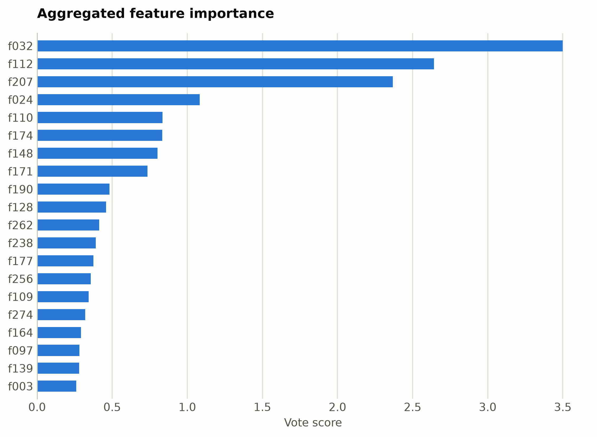
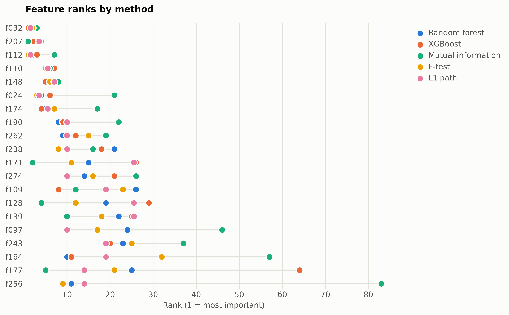

# SST-2 sentiment from averaged GloVe vectors

The classical dense text representation: 300-dimensional GloVe word vectors averaged over each sentence, no context. A direct contrast with the contextual ModernBERT run on the same task.

Data: stanfordnlp/sst2 with glove-wiki-gigaword-300, 4,000 sentences. 4,000 samples, 300 features. One five-method
ensemble ranking of the training split took 39 s and
provides every selector below; reductions fit on the same split. Three
standardized probes (accuracy: linear, kNN, RBF SVM) score the held-out
20%. Budgets anchor at the 99%-variance PCA count x = 219, stepping
x, x/2, x/4, 10, 1.

## Consensus ranking

| feature | score |
|---|---|
| f032 | 3.5 |
| f112 | 2.643 |
| f207 | 2.369 |
| f024 | 1.083 |
| f110 | 0.8342 |
| f174 | 0.8335 |
| f148 | 0.8012 |
| f171 | 0.7353 |
| f190 | 0.4816 |
| f128 | 0.4597 |

## Ablation: selectors vs reductions (accuracy)

`select:<method>` keeps that method's top-k raw features
(`select:vote` is the ensemble); `dr:<method>` is a fitted reduction to
the same k.

| k | representation | linear | knn | svm |
|---|---|---|---|---|
| 300 | all features | 0.7875 | 0.7125 | 0.8112 |
| 219 | dr:PCA | 0.7862 | 0.6325 | 0.78 |
| 219 | dr:RandProj | 0.7887 | 0.6938 | 0.7912 |
| 219 | select:f_test | 0.7938 | 0.7262 | 0.805 |
| 219 | select:l1 | 0.7875 | 0.7038 | 0.8075 |
| 219 | select:mi | 0.8 | 0.715 | 0.8112 |
| 219 | select:rf | 0.795 | 0.7 | 0.8138 |
| 219 | select:vote | 0.8012 | 0.7113 | 0.8075 |
| 219 | select:xg | 0.7962 | 0.7262 | 0.8075 |
| 109 | dr:PCA | 0.7862 | 0.6688 | 0.8125 |
| 109 | dr:RandProj | 0.7575 | 0.6738 | 0.775 |
| 109 | select:f_test | 0.785 | 0.7512 | 0.8 |
| 109 | select:l1 | 0.7962 | 0.7475 | 0.805 |
| 109 | select:mi | 0.7825 | 0.72 | 0.805 |
| 109 | select:rf | 0.8 | 0.7412 | 0.8038 |
| 109 | select:vote | 0.7912 | 0.7412 | 0.7988 |
| 109 | select:xg | 0.7938 | 0.7275 | 0.8062 |
| 54 | dr:ICA | 0.7938 | 0.6625 | 0.7962 |
| 54 | dr:Isomap | 0.6712 | 0.6238 | 0.68 |
| 54 | dr:KernelPCA | 0.795 | 0.7288 | 0.795 |
| 54 | dr:PCA | 0.7938 | 0.6625 | 0.7962 |
| 54 | dr:RandProj | 0.6875 | 0.6762 | 0.7388 |
| 54 | dr:UMAP | 0.7012 | 0.6637 | 0.69 |
| 54 | select:f_test | 0.7887 | 0.7375 | 0.7962 |
| 54 | select:l1 | 0.7938 | 0.7462 | 0.7962 |
| 54 | select:mi | 0.7837 | 0.7225 | 0.7887 |
| 54 | select:rf | 0.7912 | 0.74 | 0.7875 |
| 54 | select:vote | 0.7762 | 0.745 | 0.7887 |
| 54 | select:xg | 0.785 | 0.75 | 0.7862 |
| 10 | dr:ICA | 0.7475 | 0.705 | 0.7625 |
| 10 | dr:Isomap | 0.6438 | 0.6162 | 0.6575 |
| 10 | dr:KernelPCA | 0.7038 | 0.705 | 0.73 |
| 10 | dr:PCA | 0.7475 | 0.705 | 0.7625 |
| 10 | dr:RandProj | 0.59 | 0.5538 | 0.6262 |
| 10 | dr:UMAP | 0.685 | 0.6575 | 0.69 |
| 10 | dr:t-SNE | 0.6288 | 0.66 | 0.6712 |
| 10 | select:f_test | 0.7188 | 0.6975 | 0.7388 |
| 10 | select:l1 | 0.7275 | 0.7125 | 0.7438 |
| 10 | select:mi | 0.73 | 0.7012 | 0.735 |
| 10 | select:rf | 0.73 | 0.7175 | 0.7425 |
| 10 | select:vote | 0.7312 | 0.7075 | 0.7312 |
| 10 | select:xg | 0.7225 | 0.7012 | 0.7412 |
| 1 | dr:ICA | 0.5488 | 0.53 | 0.5538 |
| 1 | dr:Isomap | 0.5875 | 0.5312 | 0.5725 |
| 1 | dr:KernelPCA | 0.5638 | 0.495 | 0.5762 |
| 1 | dr:PCA | 0.5488 | 0.53 | 0.5538 |
| 1 | dr:RandProj | 0.5425 | 0.5125 | 0.5438 |
| 1 | dr:UMAP | 0.6238 | 0.6012 | 0.6162 |
| 1 | dr:t-SNE | 0.6175 | 0.5725 | 0.6212 |
| 1 | select:f_test | 0.62 | 0.6138 | 0.6362 |
| 1 | select:l1 | 0.5938 | 0.5612 | 0.605 |
| 1 | select:mi | 0.6012 | 0.575 | 0.6112 |
| 1 | select:rf | 0.5938 | 0.5612 | 0.605 |
| 1 | select:vote | 0.5938 | 0.5612 | 0.605 |
| 1 | select:xg | 0.5938 | 0.5612 | 0.605 |

Notes: t-SNE has no out-of-sample transform, so it is fit on all rows
(label-blind) and split afterward, which favors it mildly; UMAP, kernel
PCA, Isomap, and ICA run at budgets up to 100 and t-SNE up to
10, beyond which their cost is impractical, while selection has
no budget ceiling. Cross-dataset findings: [the research report](report.md).

Regenerate with `python examples/selection_vs_reduction.py --name glove_sst2`.
