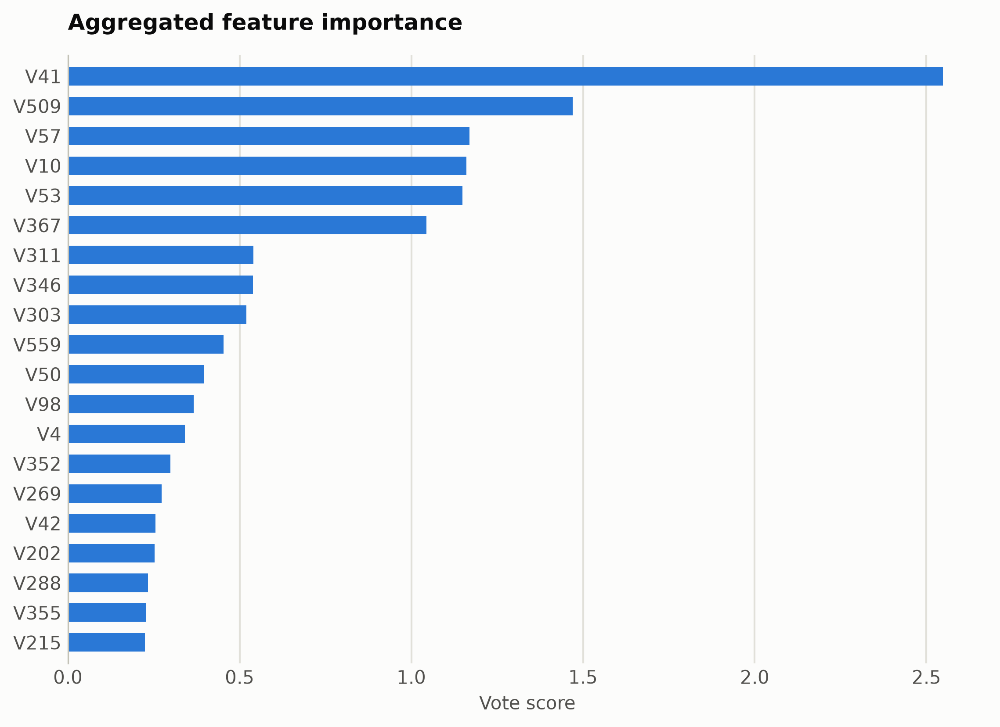
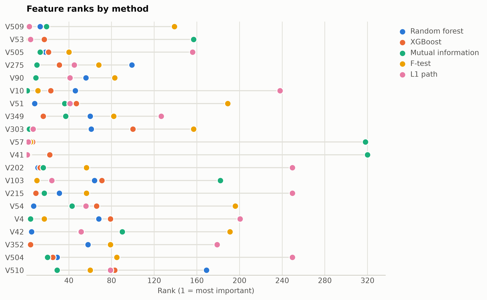

# Human activity from smartphone sensors

Six activities from 561 engineered accelerometer and gyroscope features.

Data: OpenML har (id 1478), 4,000-sample subset. 4,000 samples, 561 features. One five-method
ensemble ranking of the training split took 979 s and
provides every selector below; reductions fit on the same split. Three
standardized probes (accuracy: linear, kNN, RBF SVM) score the held-out
20%. Budgets anchor at the 99%-variance PCA count x = 178, stepping
x, x/2, x/4, 10, 1.

## Consensus ranking

| feature | score |
|---|---|
| V41 | 2.549 |
| V509 | 1.47 |
| V57 | 1.17 |
| V10 | 1.16 |
| V53 | 1.149 |
| V367 | 1.044 |
| V311 | 0.5407 |
| V346 | 0.5394 |
| V303 | 0.5199 |
| V559 | 0.453 |

## Ablation: selectors vs reductions (accuracy)

`select:<method>` keeps that method's top-k raw features
(`select:vote` is the ensemble); `dr:<method>` is a fitted reduction to
the same k.

| k | representation | linear | knn | svm |
|---|---|---|---|---|
| 561 | all features | 0.9688 | 0.9362 | 0.9662 |
| 178 | dr:PCA | 0.9525 | 0.7075 | 0.9312 |
| 178 | dr:RandProj | 0.9575 | 0.9288 | 0.9562 |
| 178 | select:f_test | 0.9575 | 0.9212 | 0.8938 |
| 178 | select:l1 | 0.97 | 0.9488 | 0.9675 |
| 178 | select:mi | 0.96 | 0.9562 | 0.935 |
| 178 | select:rf | 0.9612 | 0.9375 | 0.955 |
| 178 | select:vote | 0.965 | 0.9412 | 0.9538 |
| 178 | select:xg | 0.9762 | 0.955 | 0.9575 |
| 89 | dr:ICA | 0.9562 | 0.825 | 0.9488 |
| 89 | dr:Isomap | 0.8962 | 0.8725 | 0.9012 |
| 89 | dr:KernelPCA | 0.9575 | 0.9238 | 0.9662 |
| 89 | dr:PCA | 0.9562 | 0.8488 | 0.9512 |
| 89 | dr:RandProj | 0.9462 | 0.9112 | 0.9475 |
| 89 | dr:UMAP | 0.8825 | 0.8762 | 0.8938 |
| 89 | select:f_test | 0.9462 | 0.9275 | 0.8962 |
| 89 | select:l1 | 0.96 | 0.9488 | 0.9612 |
| 89 | select:mi | 0.9175 | 0.9112 | 0.8925 |
| 89 | select:rf | 0.9512 | 0.9275 | 0.94 |
| 89 | select:vote | 0.9525 | 0.9325 | 0.9338 |
| 89 | select:xg | 0.9388 | 0.935 | 0.9325 |
| 44 | dr:ICA | 0.9375 | 0.8638 | 0.9288 |
| 44 | dr:Isomap | 0.88 | 0.8675 | 0.8962 |
| 44 | dr:KernelPCA | 0.9438 | 0.915 | 0.9462 |
| 44 | dr:PCA | 0.9325 | 0.8725 | 0.9288 |
| 44 | dr:RandProj | 0.9025 | 0.8775 | 0.9125 |
| 44 | dr:UMAP | 0.8912 | 0.8988 | 0.8825 |
| 44 | select:f_test | 0.9175 | 0.8775 | 0.8488 |
| 44 | select:l1 | 0.955 | 0.9325 | 0.9525 |
| 44 | select:mi | 0.8838 | 0.89 | 0.8775 |
| 44 | select:rf | 0.9238 | 0.9138 | 0.9175 |
| 44 | select:vote | 0.9212 | 0.9262 | 0.9288 |
| 44 | select:xg | 0.9275 | 0.9212 | 0.925 |
| 10 | dr:ICA | 0.8612 | 0.8662 | 0.8762 |
| 10 | dr:Isomap | 0.8238 | 0.8675 | 0.8762 |
| 10 | dr:KernelPCA | 0.8425 | 0.84 | 0.8625 |
| 10 | dr:PCA | 0.8612 | 0.8662 | 0.8762 |
| 10 | dr:RandProj | 0.7262 | 0.7175 | 0.7638 |
| 10 | dr:UMAP | 0.8688 | 0.9012 | 0.8762 |
| 10 | dr:t-SNE | 0.7925 | 0.8988 | 0.8875 |
| 10 | select:f_test | 0.745 | 0.7525 | 0.735 |
| 10 | select:l1 | 0.8438 | 0.855 | 0.8462 |
| 10 | select:mi | 0.6575 | 0.6538 | 0.575 |
| 10 | select:rf | 0.62 | 0.7562 | 0.565 |
| 10 | select:vote | 0.8588 | 0.8962 | 0.83 |
| 10 | select:xg | 0.8062 | 0.8162 | 0.8125 |
| 1 | dr:ICA | 0.4338 | 0.4075 | 0.4412 |
| 1 | dr:Isomap | 0.4775 | 0.495 | 0.48 |
| 1 | dr:KernelPCA | 0.375 | 0.3688 | 0.4 |
| 1 | dr:PCA | 0.4338 | 0.4075 | 0.4412 |
| 1 | dr:RandProj | 0.3075 | 0.2938 | 0.3412 |
| 1 | dr:UMAP | 0.7837 | 0.815 | 0.8075 |
| 1 | dr:t-SNE | 0.695 | 0.8038 | 0.7887 |
| 1 | select:f_test | 0.4212 | 0.3738 | 0.4212 |
| 1 | select:l1 | 0.4112 | 0.425 | 0.435 |
| 1 | select:mi | 0.525 | 0.4925 | 0.48 |
| 1 | select:rf | 0.4112 | 0.425 | 0.435 |
| 1 | select:vote | 0.4112 | 0.425 | 0.435 |
| 1 | select:xg | 0.4512 | 0.4725 | 0.4825 |

Notes: t-SNE has no out-of-sample transform, so it is fit on all rows
(label-blind) and split afterward, which favors it mildly; UMAP, kernel
PCA, Isomap, and ICA run at budgets up to 100 and t-SNE up to
10, beyond which their cost is impractical, while selection has
no budget ceiling. Cross-dataset findings: [the research report](report.md).

Regenerate with `python examples/selection_vs_reduction.py --name har_sensors`.
