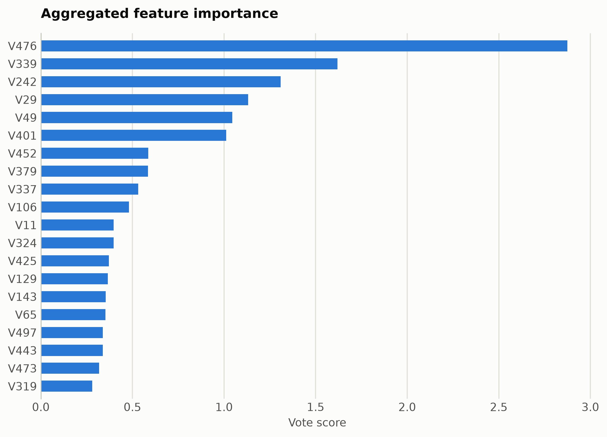
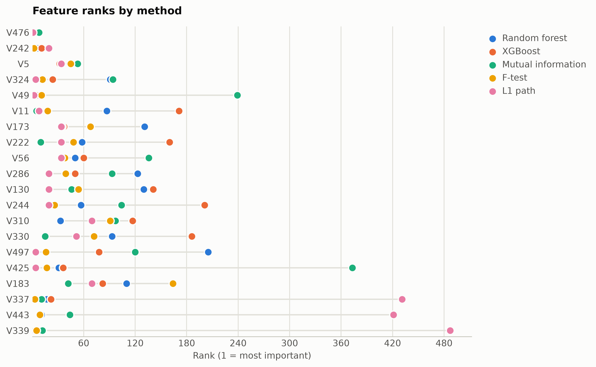

# Madelon synthetic selection benchmark

The NIPS 2003 feature-selection benchmark: 20 informative features hidden among 480 engineered probes and noise, built to defeat naive selectors.

Data: OpenML madelon (id 1485), 2,600 samples, 500 features. 2,600 samples, 500 features. One five-method
ensemble ranking of the training split took 43 s and
provides every selector below; reductions fit on the same split. Three
standardized probes (accuracy: linear, kNN, RBF SVM) score the held-out
20%. Budgets anchor at the 99%-variance PCA count x = 470, stepping
x, x/2, x/4, 10, 1.

## Consensus ranking

| feature | score |
|---|---|
| V476 | 2.875 |
| V339 | 1.619 |
| V242 | 1.309 |
| V29 | 1.132 |
| V49 | 1.045 |
| V401 | 1.012 |
| V452 | 0.5863 |
| V379 | 0.5848 |
| V337 | 0.5308 |
| V106 | 0.4815 |

## Ablation: selectors vs reductions (accuracy)

`select:<method>` keeps that method's top-k raw features
(`select:vote` is the ensemble); `dr:<method>` is a fitted reduction to
the same k.

| k | representation | linear | knn | svm |
|---|---|---|---|---|
| 500 | all features | 0.5462 | 0.5846 | 0.5981 |
| 470 | dr:PCA | 0.55 | 0.4904 | 0.5615 |
| 470 | dr:RandProj | 0.5327 | 0.5558 | 0.5865 |
| 470 | select:f_test | 0.5385 | 0.5519 | 0.5942 |
| 470 | select:l1 | 0.5481 | 0.575 | 0.5865 |
| 470 | select:mi | 0.5538 | 0.5885 | 0.5865 |
| 470 | select:rf | 0.5519 | 0.5596 | 0.5788 |
| 470 | select:vote | 0.5404 | 0.5769 | 0.6 |
| 470 | select:xg | 0.5269 | 0.5635 | 0.5769 |
| 235 | dr:PCA | 0.5596 | 0.5288 | 0.5577 |
| 235 | dr:RandProj | 0.5365 | 0.5269 | 0.5808 |
| 235 | select:f_test | 0.5731 | 0.5923 | 0.5904 |
| 235 | select:l1 | 0.55 | 0.5269 | 0.5731 |
| 235 | select:mi | 0.5615 | 0.5654 | 0.5962 |
| 235 | select:rf | 0.5808 | 0.6231 | 0.6212 |
| 235 | select:vote | 0.5635 | 0.6058 | 0.6058 |
| 235 | select:xg | 0.5712 | 0.5981 | 0.6192 |
| 117 | dr:PCA | 0.6038 | 0.525 | 0.5981 |
| 117 | dr:RandProj | 0.575 | 0.4923 | 0.5885 |
| 117 | select:f_test | 0.5558 | 0.6115 | 0.5885 |
| 117 | select:l1 | 0.5673 | 0.5135 | 0.5712 |
| 117 | select:mi | 0.5904 | 0.6019 | 0.6077 |
| 117 | select:rf | 0.6 | 0.6615 | 0.6712 |
| 117 | select:vote | 0.6038 | 0.675 | 0.6481 |
| 117 | select:xg | 0.5731 | 0.6519 | 0.6481 |
| 10 | dr:ICA | 0.65 | 0.75 | 0.7481 |
| 10 | dr:Isomap | 0.5231 | 0.4942 | 0.5346 |
| 10 | dr:KernelPCA | 0.6462 | 0.7385 | 0.7423 |
| 10 | dr:PCA | 0.6385 | 0.7519 | 0.75 |
| 10 | dr:RandProj | 0.5327 | 0.5192 | 0.5115 |
| 10 | dr:UMAP | 0.5519 | 0.5904 | 0.5692 |
| 10 | dr:t-SNE | 0.5058 | 0.5173 | 0.5308 |
| 10 | select:f_test | 0.6327 | 0.7904 | 0.7519 |
| 10 | select:l1 | 0.5904 | 0.5788 | 0.5981 |
| 10 | select:mi | 0.6231 | 0.5442 | 0.6269 |
| 10 | select:rf | 0.6404 | 0.8712 | 0.8577 |
| 10 | select:vote | 0.6385 | 0.8519 | 0.8288 |
| 10 | select:xg | 0.6404 | 0.9019 | 0.8481 |
| 1 | dr:ICA | 0.6154 | 0.5673 | 0.6635 |
| 1 | dr:Isomap | 0.4635 | 0.4885 | 0.5135 |
| 1 | dr:KernelPCA | 0.6135 | 0.6019 | 0.6538 |
| 1 | dr:PCA | 0.6154 | 0.5673 | 0.6635 |
| 1 | dr:RandProj | 0.5269 | 0.475 | 0.525 |
| 1 | dr:UMAP | 0.4846 | 0.5038 | 0.5 |
| 1 | dr:t-SNE | 0.5442 | 0.5231 | 0.5442 |
| 1 | select:f_test | 0.6385 | 0.5712 | 0.6346 |
| 1 | select:l1 | 0.6385 | 0.5712 | 0.6346 |
| 1 | select:mi | 0.5173 | 0.5173 | 0.5346 |
| 1 | select:rf | 0.5885 | 0.5404 | 0.6212 |
| 1 | select:vote | 0.6385 | 0.5712 | 0.6346 |
| 1 | select:xg | 0.4577 | 0.4962 | 0.4962 |

Notes: t-SNE has no out-of-sample transform, so it is fit on all rows
(label-blind) and split afterward, which favors it mildly; UMAP, kernel
PCA, Isomap, and ICA run at budgets up to 100 and t-SNE up to
10, beyond which their cost is impractical, while selection has
no budget ceiling. Cross-dataset findings: [the research report](report.md).

Regenerate with `python examples/selection_vs_reduction.py --name madelon`.
