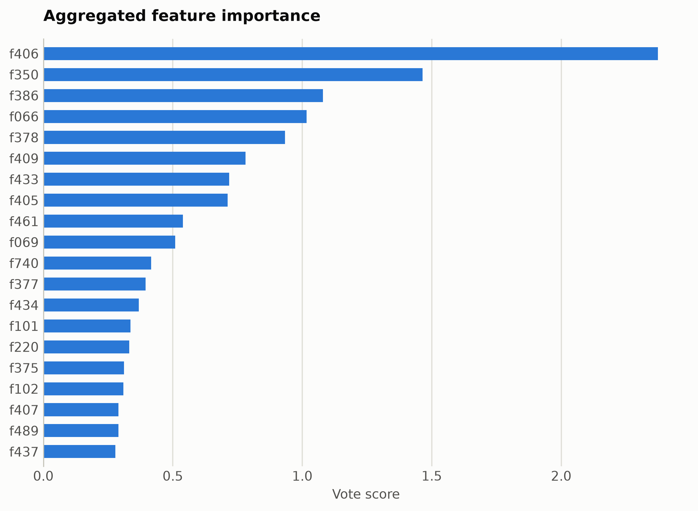
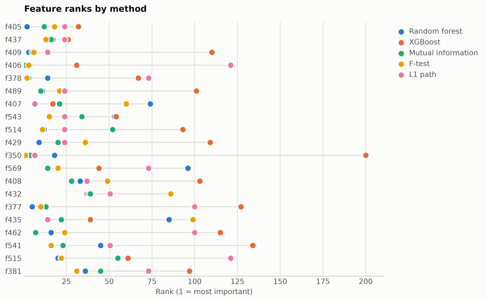

# MNIST from raw pixels

28x28 MNIST pixels passed as an unnamed numpy matrix (784 generated IDs), ten classes.

Data: OpenML mnist_784 (id 554), 4,000-image subset. 4,000 samples, 784 features. One five-method
ensemble ranking of the training split took 1999 s and
provides every selector below; reductions fit on the same split. Three
standardized probes (accuracy: linear, kNN, RBF SVM) score the held-out
20%. Budgets anchor at the 99%-variance PCA count x = 431, stepping
x, x/2, x/4, 10, 1.

## Consensus ranking

| feature | score |
|---|---|
| f406 | 2.374 |
| f350 | 1.464 |
| f386 | 1.08 |
| f066 | 1.016 |
| f378 | 0.9334 |
| f409 | 0.7805 |
| f433 | 0.7174 |
| f405 | 0.7118 |
| f461 | 0.5386 |
| f069 | 0.5086 |

## Ablation: selectors vs reductions (accuracy)

`select:<method>` keeps that method's top-k raw features
(`select:vote` is the ensemble); `dr:<method>` is a fitted reduction to
the same k.

| k | representation | linear | knn | svm |
|---|---|---|---|---|
| 784 | all features | 0.8775 | 0.865 | 0.9188 |
| 431 | dr:PCA | 0.8012 | 0.2575 | 0.8162 |
| 431 | dr:RandProj | 0.855 | 0.8512 | 0.9112 |
| 431 | select:f_test | 0.8775 | 0.88 | 0.935 |
| 431 | select:l1 | 0.87 | 0.8875 | 0.92 |
| 431 | select:mi | 0.8762 | 0.8862 | 0.9362 |
| 431 | select:rf | 0.8812 | 0.885 | 0.935 |
| 431 | select:vote | 0.865 | 0.8888 | 0.9375 |
| 431 | select:xg | 0.87 | 0.8762 | 0.9312 |
| 215 | dr:PCA | 0.855 | 0.6625 | 0.8762 |
| 215 | dr:RandProj | 0.8412 | 0.8512 | 0.91 |
| 215 | select:f_test | 0.8388 | 0.895 | 0.9338 |
| 215 | select:l1 | 0.84 | 0.875 | 0.9238 |
| 215 | select:mi | 0.8512 | 0.8912 | 0.9512 |
| 215 | select:rf | 0.8375 | 0.9212 | 0.9525 |
| 215 | select:vote | 0.85 | 0.8588 | 0.9225 |
| 215 | select:xg | 0.8438 | 0.8338 | 0.8988 |
| 107 | dr:PCA | 0.8838 | 0.8225 | 0.9088 |
| 107 | dr:RandProj | 0.83 | 0.8275 | 0.9 |
| 107 | select:f_test | 0.8012 | 0.8412 | 0.8888 |
| 107 | select:l1 | 0.855 | 0.8362 | 0.89 |
| 107 | select:mi | 0.8088 | 0.8325 | 0.8975 |
| 107 | select:rf | 0.8138 | 0.8775 | 0.9175 |
| 107 | select:vote | 0.82 | 0.8225 | 0.8925 |
| 107 | select:xg | 0.8362 | 0.7825 | 0.8612 |
| 10 | dr:ICA | 0.765 | 0.815 | 0.85 |
| 10 | dr:Isomap | 0.81 | 0.82 | 0.85 |
| 10 | dr:KernelPCA | 0.7612 | 0.8275 | 0.8562 |
| 10 | dr:PCA | 0.7862 | 0.835 | 0.8838 |
| 10 | dr:RandProj | 0.4962 | 0.5675 | 0.6188 |
| 10 | dr:UMAP | 0.7962 | 0.815 | 0.8175 |
| 10 | dr:t-SNE | 0.72 | 0.8062 | 0.8012 |
| 10 | select:f_test | 0.57 | 0.5662 | 0.6012 |
| 10 | select:l1 | 0.4162 | 0.4225 | 0.4462 |
| 10 | select:mi | 0.5387 | 0.5475 | 0.5775 |
| 10 | select:rf | 0.57 | 0.5725 | 0.6212 |
| 10 | select:vote | 0.505 | 0.5062 | 0.5162 |
| 10 | select:xg | 0.2775 | 0.235 | 0.2838 |
| 1 | dr:ICA | 0.2862 | 0.2588 | 0.2838 |
| 1 | dr:Isomap | 0.4338 | 0.4025 | 0.4425 |
| 1 | dr:KernelPCA | 0.21 | 0.235 | 0.2362 |
| 1 | dr:PCA | 0.2862 | 0.2588 | 0.2838 |
| 1 | dr:RandProj | 0.175 | 0.195 | 0.22 |
| 1 | dr:UMAP | 0.5913 | 0.7188 | 0.6975 |
| 1 | dr:t-SNE | 0.5288 | 0.615 | 0.5925 |
| 1 | select:f_test | 0.1925 | 0.1788 | 0.1925 |
| 1 | select:l1 | 0.1575 | 0.1462 | 0.1638 |
| 1 | select:mi | 0.2312 | 0.2212 | 0.2238 |
| 1 | select:rf | 0.2312 | 0.2212 | 0.2238 |
| 1 | select:vote | 0.2312 | 0.2212 | 0.2238 |
| 1 | select:xg | 0.1138 | 0.09 | 0.1138 |

Notes: t-SNE has no out-of-sample transform, so it is fit on all rows
(label-blind) and split afterward, which favors it mildly; UMAP, kernel
PCA, Isomap, and ICA run at budgets up to 100 and t-SNE up to
10, beyond which their cost is impractical, while selection has
no budget ceiling. Cross-dataset findings: [the research report](report.md).

Regenerate with `python examples/selection_vs_reduction.py --name mnist_pixels`.
