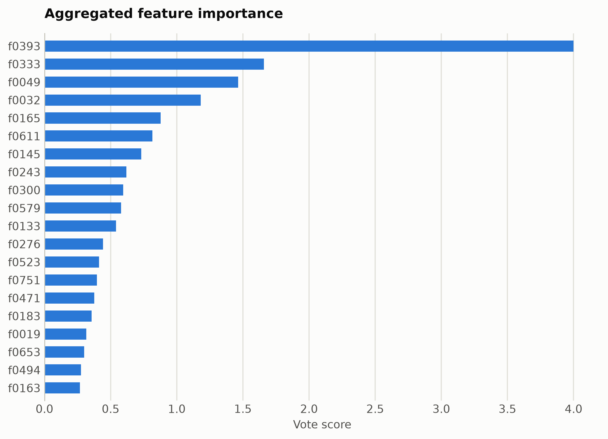
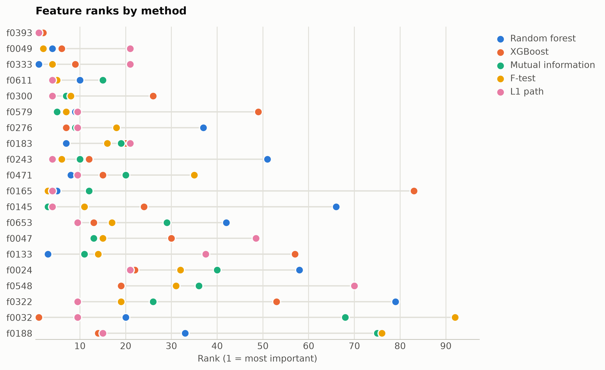

# AG News topics from ModernBERT embeddings

Four-way news topic classification. Features are mask-aware mean plus variance pooled ModernBERT-base hidden states (1,536 unnamed dimensions), ranked straight from the numpy matrix.

Data: ag_news, 4,000 headlines with descriptions. 4,000 samples, 1,536 features. One five-method
ensemble ranking of the training split took 1700 s and
provides every selector below; reductions fit on the same split. Three
standardized probes (accuracy: linear, kNN, RBF SVM) score the held-out
20%. Budgets anchor at the 99%-variance PCA count x = 1153, stepping
x, x/2, x/4, 10, 1.

## Consensus ranking

| feature | score |
|---|---|
| f0393 | 4 |
| f0333 | 1.659 |
| f0049 | 1.464 |
| f0032 | 1.181 |
| f0165 | 0.8787 |
| f0611 | 0.8167 |
| f0145 | 0.7311 |
| f0243 | 0.6196 |
| f0300 | 0.5948 |
| f0579 | 0.5796 |

## Ablation: selectors vs reductions (accuracy)

`select:<method>` keeps that method's top-k raw features
(`select:vote` is the ensemble); `dr:<method>` is a fitted reduction to
the same k.

| k | representation | linear | knn | svm |
|---|---|---|---|---|
| 1536 | all features | 0.8488 | 0.8575 | 0.8912 |
| 1153 | dr:PCA | 0.795 | 0.2475 | 0.6138 |
| 1153 | dr:RandProj | 0.8438 | 0.8412 | 0.895 |
| 1153 | select:f_test | 0.8475 | 0.8675 | 0.8875 |
| 1153 | select:l1 | 0.8525 | 0.8512 | 0.885 |
| 1153 | select:mi | 0.8475 | 0.865 | 0.885 |
| 1153 | select:rf | 0.8425 | 0.865 | 0.8925 |
| 1153 | select:vote | 0.84 | 0.8675 | 0.8925 |
| 1153 | select:xg | 0.8288 | 0.865 | 0.8888 |
| 576 | dr:PCA | 0.8312 | 0.325 | 0.8938 |
| 576 | dr:RandProj | 0.8125 | 0.8362 | 0.8875 |
| 576 | select:f_test | 0.8212 | 0.8612 | 0.8888 |
| 576 | select:l1 | 0.8325 | 0.8638 | 0.89 |
| 576 | select:mi | 0.8138 | 0.8612 | 0.89 |
| 576 | select:rf | 0.82 | 0.8662 | 0.8888 |
| 576 | select:vote | 0.8225 | 0.8662 | 0.885 |
| 576 | select:xg | 0.8138 | 0.8625 | 0.89 |
| 288 | dr:PCA | 0.84 | 0.7088 | 0.9012 |
| 288 | dr:RandProj | 0.8075 | 0.8212 | 0.8738 |
| 288 | select:f_test | 0.8412 | 0.8675 | 0.885 |
| 288 | select:l1 | 0.8175 | 0.8788 | 0.8888 |
| 288 | select:mi | 0.8138 | 0.8688 | 0.8862 |
| 288 | select:rf | 0.8338 | 0.865 | 0.8925 |
| 288 | select:vote | 0.8225 | 0.8788 | 0.8888 |
| 288 | select:xg | 0.8288 | 0.8712 | 0.8812 |
| 10 | dr:ICA | 0.845 | 0.8212 | 0.85 |
| 10 | dr:Isomap | 0.8038 | 0.8062 | 0.83 |
| 10 | dr:KernelPCA | 0.835 | 0.8238 | 0.8475 |
| 10 | dr:PCA | 0.845 | 0.8238 | 0.85 |
| 10 | dr:RandProj | 0.575 | 0.5425 | 0.5662 |
| 10 | dr:UMAP | 0.83 | 0.8438 | 0.84 |
| 10 | dr:t-SNE | 0.7825 | 0.8088 | 0.8262 |
| 10 | select:f_test | 0.7012 | 0.6988 | 0.7238 |
| 10 | select:l1 | 0.7325 | 0.7062 | 0.7288 |
| 10 | select:mi | 0.6988 | 0.7012 | 0.7175 |
| 10 | select:rf | 0.7138 | 0.7138 | 0.745 |
| 10 | select:vote | 0.7188 | 0.7062 | 0.7225 |
| 10 | select:xg | 0.7488 | 0.7238 | 0.7475 |
| 1 | dr:ICA | 0.32 | 0.2912 | 0.3238 |
| 1 | dr:Isomap | 0.6312 | 0.6212 | 0.6375 |
| 1 | dr:KernelPCA | 0.3088 | 0.2562 | 0.3262 |
| 1 | dr:PCA | 0.32 | 0.2912 | 0.3225 |
| 1 | dr:RandProj | 0.3325 | 0.2862 | 0.335 |
| 1 | dr:UMAP | 0.64 | 0.78 | 0.77 |
| 1 | dr:t-SNE | 0.5375 | 0.7338 | 0.7288 |
| 1 | select:f_test | 0.4675 | 0.44 | 0.4625 |
| 1 | select:l1 | 0.4675 | 0.44 | 0.4625 |
| 1 | select:mi | 0.4675 | 0.44 | 0.4625 |
| 1 | select:rf | 0.4138 | 0.3612 | 0.4175 |
| 1 | select:vote | 0.4675 | 0.44 | 0.4625 |
| 1 | select:xg | 0.4038 | 0.36 | 0.4212 |

Notes: t-SNE has no out-of-sample transform, so it is fit on all rows
(label-blind) and split afterward, which favors it mildly; UMAP, kernel
PCA, Isomap, and ICA run at budgets up to 100 and t-SNE up to
10, beyond which their cost is impractical, while selection has
no budget ceiling. Cross-dataset findings: [the research report](report.md).

Regenerate with `python examples/selection_vs_reduction.py --name modernbert_agnews`.
