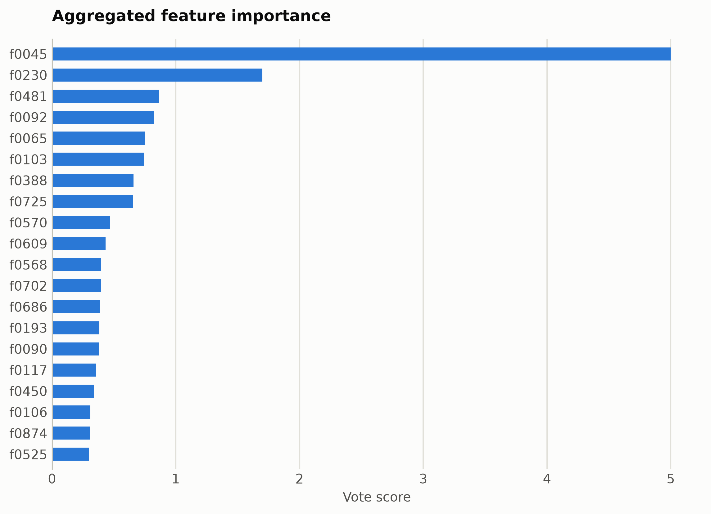
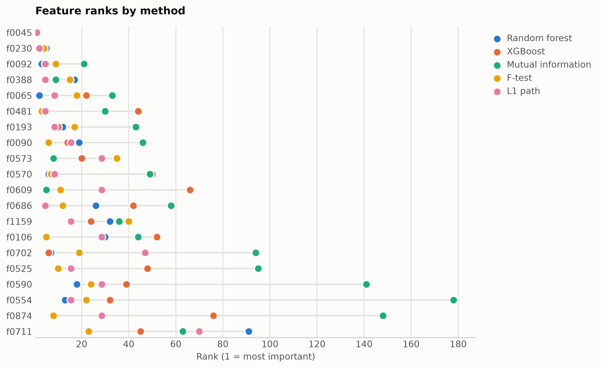

# Emotion recognition from ModernBERT embeddings

Six-way emotion classification of short messages. Features are mask-aware mean plus variance pooled ModernBERT-base hidden states (1,536 unnamed dimensions), ranked straight from the numpy matrix.

Data: dair-ai/emotion, 4,000 messages. 4,000 samples, 1,536 features. One five-method
ensemble ranking of the training split took 2202 s and
provides every selector below; reductions fit on the same split. Three
standardized probes (accuracy: linear, kNN, RBF SVM) score the held-out
20%. Budgets anchor at the 99%-variance PCA count x = 1171, stepping
x, x/2, x/4, 10, 1.

## Consensus ranking

| feature | score |
|---|---|
| f0045 | 5 |
| f0230 | 1.7 |
| f0481 | 0.8616 |
| f0092 | 0.8254 |
| f0065 | 0.749 |
| f0103 | 0.7418 |
| f0388 | 0.6588 |
| f0725 | 0.6565 |
| f0570 | 0.4676 |
| f0609 | 0.4321 |

## Ablation: selectors vs reductions (accuracy)

`select:<method>` keeps that method's top-k raw features
(`select:vote` is the ensemble); `dr:<method>` is a fitted reduction to
the same k.

| k | representation | linear | knn | svm |
|---|---|---|---|---|
| 1536 | all features | 0.5562 | 0.3962 | 0.58 |
| 1171 | dr:PCA | 0.4988 | 0.3488 | 0.455 |
| 1171 | dr:RandProj | 0.5125 | 0.3838 | 0.5612 |
| 1171 | select:f_test | 0.5462 | 0.415 | 0.585 |
| 1171 | select:l1 | 0.54 | 0.4112 | 0.5925 |
| 1171 | select:mi | 0.5312 | 0.4212 | 0.5875 |
| 1171 | select:rf | 0.5575 | 0.4225 | 0.5875 |
| 1171 | select:vote | 0.5312 | 0.4175 | 0.5913 |
| 1171 | select:xg | 0.5525 | 0.4212 | 0.58 |
| 585 | dr:PCA | 0.5188 | 0.3688 | 0.575 |
| 585 | dr:RandProj | 0.4562 | 0.3825 | 0.5438 |
| 585 | select:f_test | 0.5387 | 0.4375 | 0.5875 |
| 585 | select:l1 | 0.4988 | 0.4275 | 0.5888 |
| 585 | select:mi | 0.4838 | 0.4225 | 0.575 |
| 585 | select:rf | 0.5175 | 0.4412 | 0.5988 |
| 585 | select:vote | 0.5337 | 0.4375 | 0.5975 |
| 585 | select:xg | 0.5025 | 0.4175 | 0.5825 |
| 292 | dr:PCA | 0.5712 | 0.3762 | 0.5975 |
| 292 | dr:RandProj | 0.4888 | 0.3738 | 0.5175 |
| 292 | select:f_test | 0.54 | 0.45 | 0.5925 |
| 292 | select:l1 | 0.5525 | 0.465 | 0.6025 |
| 292 | select:mi | 0.5075 | 0.415 | 0.5675 |
| 292 | select:rf | 0.5425 | 0.4762 | 0.5888 |
| 292 | select:vote | 0.5488 | 0.4575 | 0.5888 |
| 292 | select:xg | 0.54 | 0.445 | 0.5913 |
| 10 | dr:ICA | 0.36 | 0.3625 | 0.395 |
| 10 | dr:Isomap | 0.365 | 0.3238 | 0.3488 |
| 10 | dr:KernelPCA | 0.3638 | 0.3575 | 0.39 |
| 10 | dr:PCA | 0.3588 | 0.3588 | 0.3938 |
| 10 | dr:RandProj | 0.375 | 0.3462 | 0.3588 |
| 10 | dr:UMAP | 0.3825 | 0.3288 | 0.3662 |
| 10 | dr:t-SNE | 0.3312 | 0.2912 | 0.3075 |
| 10 | select:f_test | 0.4238 | 0.3725 | 0.4238 |
| 10 | select:l1 | 0.4362 | 0.3962 | 0.43 |
| 10 | select:mi | 0.425 | 0.365 | 0.415 |
| 10 | select:rf | 0.4338 | 0.3962 | 0.4325 |
| 10 | select:vote | 0.425 | 0.3825 | 0.4175 |
| 10 | select:xg | 0.425 | 0.3825 | 0.4162 |
| 1 | dr:ICA | 0.3338 | 0.2912 | 0.3338 |
| 1 | dr:Isomap | 0.3388 | 0.3075 | 0.3175 |
| 1 | dr:KernelPCA | 0.3412 | 0.3275 | 0.34 |
| 1 | dr:PCA | 0.3338 | 0.2912 | 0.3338 |
| 1 | dr:RandProj | 0.34 | 0.2862 | 0.3338 |
| 1 | dr:UMAP | 0.3438 | 0.3162 | 0.3075 |
| 1 | dr:t-SNE | 0.3438 | 0.2975 | 0.3 |
| 1 | select:f_test | 0.3725 | 0.3525 | 0.3738 |
| 1 | select:l1 | 0.3725 | 0.3525 | 0.3738 |
| 1 | select:mi | 0.3725 | 0.3525 | 0.3738 |
| 1 | select:rf | 0.3725 | 0.3525 | 0.3738 |
| 1 | select:vote | 0.3725 | 0.3525 | 0.3738 |
| 1 | select:xg | 0.3725 | 0.3525 | 0.3738 |

Notes: t-SNE has no out-of-sample transform, so it is fit on all rows
(label-blind) and split afterward, which favors it mildly; UMAP, kernel
PCA, Isomap, and ICA run at budgets up to 100 and t-SNE up to
10, beyond which their cost is impractical, while selection has
no budget ceiling. Cross-dataset findings: [the research report](report.md).

Regenerate with `python examples/selection_vs_reduction.py --name modernbert_emotion`.
