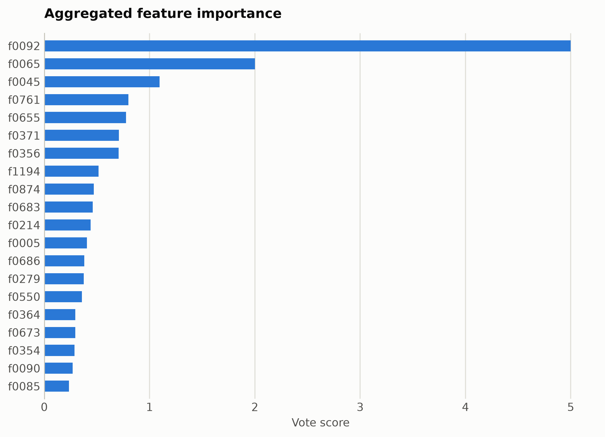
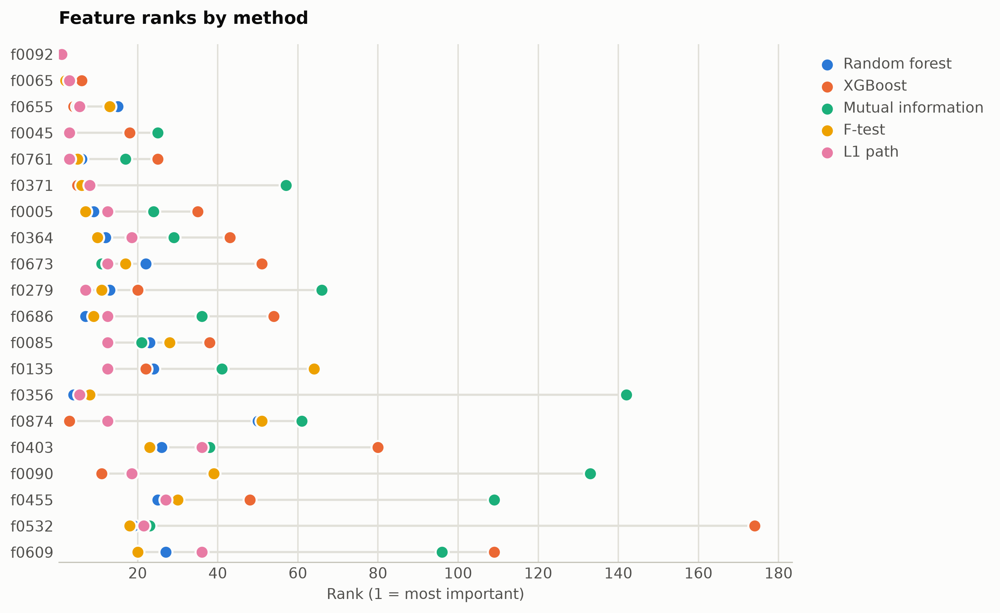

# IMDB reviews from ModernBERT embeddings

Binary sentiment over long-form movie reviews (256-token window). Features are mask-aware mean plus variance pooled ModernBERT-base hidden states (1,536 unnamed dimensions), ranked straight from the numpy matrix.

Data: imdb, 3,000 reviews. 3,000 samples, 1,536 features. One five-method
ensemble ranking of the training split took 83 s and
provides every selector below; reductions fit on the same split. Three
standardized probes (accuracy: linear, kNN, RBF SVM) score the held-out
20%. Budgets anchor at the 99%-variance PCA count x = 997, stepping
x, x/2, x/4, 10, 1.

## Consensus ranking

| feature | score |
|---|---|
| f0092 | 5 |
| f0065 | 2 |
| f0045 | 1.096 |
| f0761 | 0.7988 |
| f0655 | 0.7754 |
| f0371 | 0.7092 |
| f0356 | 0.7067 |
| f1194 | 0.516 |
| f0874 | 0.4693 |
| f0683 | 0.4591 |

## Ablation: selectors vs reductions (accuracy)

`select:<method>` keeps that method's top-k raw features
(`select:vote` is the ensemble); `dr:<method>` is a fitted reduction to
the same k.

| k | representation | linear | knn | svm |
|---|---|---|---|---|
| 1536 | all features | 0.775 | 0.6517 | 0.8233 |
| 997 | dr:PCA | 0.74 | 0.5717 | 0.76 |
| 997 | dr:RandProj | 0.755 | 0.6633 | 0.825 |
| 997 | select:f_test | 0.7567 | 0.6883 | 0.825 |
| 997 | select:l1 | 0.7767 | 0.67 | 0.8317 |
| 997 | select:mi | 0.7567 | 0.67 | 0.8183 |
| 997 | select:rf | 0.755 | 0.7 | 0.8217 |
| 997 | select:vote | 0.7683 | 0.675 | 0.8183 |
| 997 | select:xg | 0.7567 | 0.69 | 0.82 |
| 498 | dr:PCA | 0.7817 | 0.565 | 0.8067 |
| 498 | dr:RandProj | 0.7733 | 0.6733 | 0.7983 |
| 498 | select:f_test | 0.7733 | 0.7133 | 0.8133 |
| 498 | select:l1 | 0.7683 | 0.6917 | 0.8317 |
| 498 | select:mi | 0.7767 | 0.69 | 0.8167 |
| 498 | select:rf | 0.7783 | 0.72 | 0.8167 |
| 498 | select:vote | 0.7867 | 0.7 | 0.8267 |
| 498 | select:xg | 0.7917 | 0.705 | 0.8183 |
| 249 | dr:PCA | 0.815 | 0.625 | 0.8317 |
| 249 | dr:RandProj | 0.7633 | 0.6183 | 0.79 |
| 249 | select:f_test | 0.7917 | 0.6933 | 0.8267 |
| 249 | select:l1 | 0.8 | 0.725 | 0.83 |
| 249 | select:mi | 0.8033 | 0.7033 | 0.82 |
| 249 | select:rf | 0.7967 | 0.7317 | 0.81 |
| 249 | select:vote | 0.79 | 0.7217 | 0.815 |
| 249 | select:xg | 0.78 | 0.705 | 0.8033 |
| 10 | dr:ICA | 0.6967 | 0.6283 | 0.69 |
| 10 | dr:Isomap | 0.6083 | 0.5783 | 0.6283 |
| 10 | dr:KernelPCA | 0.685 | 0.66 | 0.6817 |
| 10 | dr:PCA | 0.6983 | 0.6283 | 0.69 |
| 10 | dr:RandProj | 0.5517 | 0.525 | 0.5117 |
| 10 | dr:UMAP | 0.6583 | 0.5833 | 0.645 |
| 10 | dr:t-SNE | 0.585 | 0.5967 | 0.6467 |
| 10 | select:f_test | 0.75 | 0.7217 | 0.7433 |
| 10 | select:l1 | 0.7667 | 0.7483 | 0.775 |
| 10 | select:mi | 0.7367 | 0.7083 | 0.7267 |
| 10 | select:rf | 0.7433 | 0.7167 | 0.74 |
| 10 | select:vote | 0.7567 | 0.7033 | 0.7633 |
| 10 | select:xg | 0.74 | 0.71 | 0.7233 |
| 1 | dr:ICA | 0.5333 | 0.5267 | 0.5383 |
| 1 | dr:Isomap | 0.5333 | 0.4883 | 0.5467 |
| 1 | dr:KernelPCA | 0.525 | 0.5067 | 0.5467 |
| 1 | dr:PCA | 0.5333 | 0.5267 | 0.5383 |
| 1 | dr:RandProj | 0.535 | 0.4617 | 0.55 |
| 1 | dr:UMAP | 0.535 | 0.5233 | 0.5433 |
| 1 | dr:t-SNE | 0.5367 | 0.5117 | 0.5267 |
| 1 | select:f_test | 0.63 | 0.6083 | 0.6383 |
| 1 | select:l1 | 0.63 | 0.6083 | 0.6383 |
| 1 | select:mi | 0.63 | 0.6083 | 0.6383 |
| 1 | select:rf | 0.63 | 0.6083 | 0.6383 |
| 1 | select:vote | 0.63 | 0.6083 | 0.6383 |
| 1 | select:xg | 0.63 | 0.6083 | 0.6383 |

Notes: t-SNE has no out-of-sample transform, so it is fit on all rows
(label-blind) and split afterward, which favors it mildly; UMAP, kernel
PCA, Isomap, and ICA run at budgets up to 100 and t-SNE up to
10, beyond which their cost is impractical, while selection has
no budget ceiling. Cross-dataset findings: [the research report](report.md).

Regenerate with `python examples/selection_vs_reduction.py --name modernbert_imdb`.
