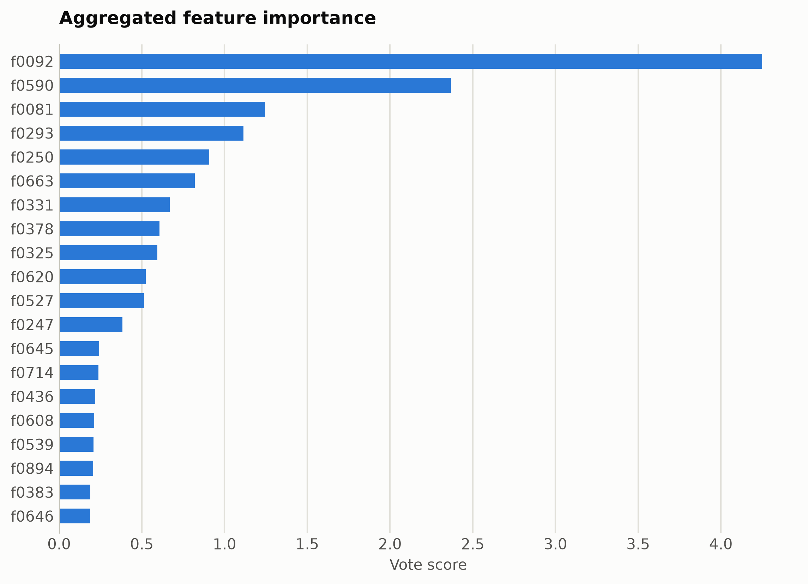
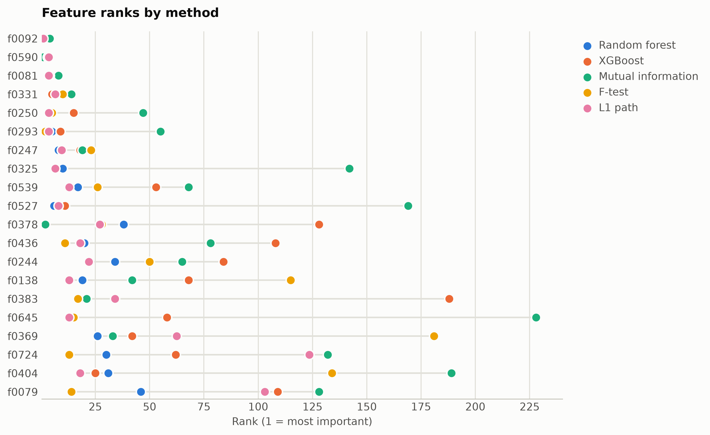

# Offensive language from ModernBERT embeddings

Binary offensive-language detection on tweets. Features are mask-aware mean plus variance pooled ModernBERT-base hidden states (1,536 unnamed dimensions), ranked straight from the numpy matrix.

Data: tweet_eval/offensive, 4,000 tweets. 4,000 samples, 1,536 features. One five-method
ensemble ranking of the training split took 176 s and
provides every selector below; reductions fit on the same split. Three
standardized probes (accuracy: linear, kNN, RBF SVM) score the held-out
20%. Budgets anchor at the 99%-variance PCA count x = 1133, stepping
x, x/2, x/4, 10, 1.

## Consensus ranking

| feature | score |
|---|---|
| f0092 | 4.25 |
| f0590 | 2.369 |
| f0081 | 1.244 |
| f0293 | 1.115 |
| f0250 | 0.907 |
| f0663 | 0.8207 |
| f0331 | 0.6681 |
| f0378 | 0.6069 |
| f0325 | 0.5942 |
| f0620 | 0.5224 |

## Ablation: selectors vs reductions (accuracy)

`select:<method>` keeps that method's top-k raw features
(`select:vote` is the ensemble); `dr:<method>` is a fitted reduction to
the same k.

| k | representation | linear | knn | svm |
|---|---|---|---|---|
| 1536 | all features | 0.6512 | 0.6938 | 0.765 |
| 1133 | dr:PCA | 0.67 | 0.5138 | 0.6888 |
| 1133 | dr:RandProj | 0.6912 | 0.68 | 0.7625 |
| 1133 | select:f_test | 0.675 | 0.6912 | 0.76 |
| 1133 | select:l1 | 0.6637 | 0.705 | 0.7575 |
| 1133 | select:mi | 0.6725 | 0.6975 | 0.7625 |
| 1133 | select:rf | 0.6675 | 0.7038 | 0.77 |
| 1133 | select:vote | 0.665 | 0.7012 | 0.7638 |
| 1133 | select:xg | 0.695 | 0.6988 | 0.76 |
| 566 | dr:PCA | 0.7163 | 0.5438 | 0.7512 |
| 566 | dr:RandProj | 0.7 | 0.6725 | 0.7575 |
| 566 | select:f_test | 0.7375 | 0.7 | 0.7738 |
| 566 | select:l1 | 0.685 | 0.7188 | 0.7512 |
| 566 | select:mi | 0.7188 | 0.6875 | 0.755 |
| 566 | select:rf | 0.7288 | 0.7113 | 0.7675 |
| 566 | select:vote | 0.7175 | 0.7038 | 0.765 |
| 566 | select:xg | 0.7225 | 0.7088 | 0.7675 |
| 283 | dr:PCA | 0.7412 | 0.6075 | 0.755 |
| 283 | dr:RandProj | 0.7288 | 0.6775 | 0.74 |
| 283 | select:f_test | 0.7512 | 0.7025 | 0.7688 |
| 283 | select:l1 | 0.7088 | 0.7038 | 0.7512 |
| 283 | select:mi | 0.7362 | 0.72 | 0.77 |
| 283 | select:rf | 0.7388 | 0.7225 | 0.7588 |
| 283 | select:vote | 0.74 | 0.7125 | 0.7775 |
| 283 | select:xg | 0.7275 | 0.7238 | 0.7638 |
| 10 | dr:ICA | 0.7113 | 0.7088 | 0.7075 |
| 10 | dr:Isomap | 0.6712 | 0.6662 | 0.6725 |
| 10 | dr:KernelPCA | 0.705 | 0.6962 | 0.7088 |
| 10 | dr:PCA | 0.7113 | 0.7088 | 0.7075 |
| 10 | dr:RandProj | 0.6637 | 0.6362 | 0.6662 |
| 10 | dr:UMAP | 0.6762 | 0.665 | 0.695 |
| 10 | dr:t-SNE | 0.6637 | 0.6738 | 0.685 |
| 10 | select:f_test | 0.7412 | 0.7125 | 0.7338 |
| 10 | select:l1 | 0.7388 | 0.705 | 0.7312 |
| 10 | select:mi | 0.7225 | 0.6612 | 0.7075 |
| 10 | select:rf | 0.7325 | 0.7163 | 0.74 |
| 10 | select:vote | 0.7375 | 0.7138 | 0.7475 |
| 10 | select:xg | 0.73 | 0.6912 | 0.7312 |
| 1 | dr:ICA | 0.665 | 0.6175 | 0.665 |
| 1 | dr:Isomap | 0.665 | 0.63 | 0.665 |
| 1 | dr:KernelPCA | 0.665 | 0.6238 | 0.665 |
| 1 | dr:PCA | 0.665 | 0.6175 | 0.665 |
| 1 | dr:RandProj | 0.665 | 0.6338 | 0.665 |
| 1 | dr:UMAP | 0.665 | 0.645 | 0.665 |
| 1 | dr:t-SNE | 0.665 | 0.6462 | 0.665 |
| 1 | select:f_test | 0.68 | 0.6488 | 0.6675 |
| 1 | select:l1 | 0.68 | 0.6488 | 0.6675 |
| 1 | select:mi | 0.6625 | 0.6388 | 0.665 |
| 1 | select:rf | 0.68 | 0.6488 | 0.6675 |
| 1 | select:vote | 0.68 | 0.6488 | 0.6675 |
| 1 | select:xg | 0.68 | 0.6488 | 0.6675 |

Notes: t-SNE has no out-of-sample transform, so it is fit on all rows
(label-blind) and split afterward, which favors it mildly; UMAP, kernel
PCA, Isomap, and ICA run at budgets up to 100 and t-SNE up to
10, beyond which their cost is impractical, while selection has
no budget ceiling. Cross-dataset findings: [the research report](report.md).

Regenerate with `python examples/selection_vs_reduction.py --name modernbert_offensive`.
