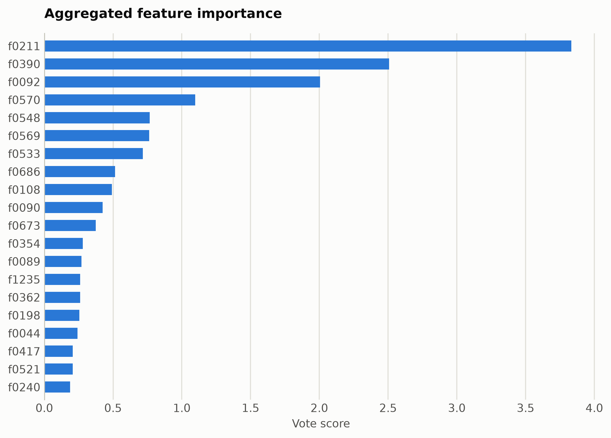
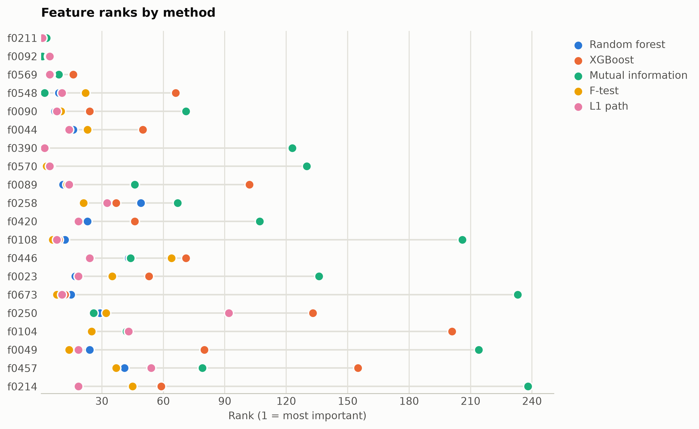
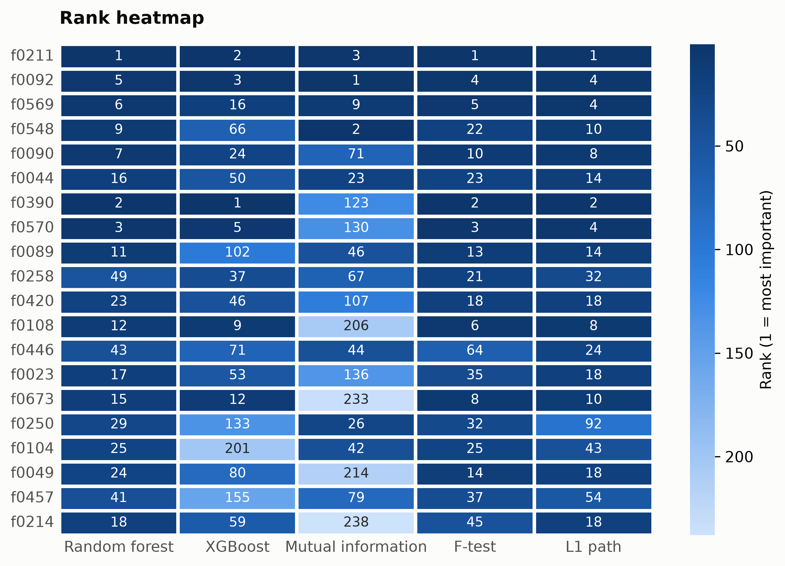

# ModernBERT sentiment: ranking unnamed embedding dimensions

Nothing in featureranker requires named columns or a table. Here the
features are the 1,536 pooled hidden-state dimensions of
[answerdotai/ModernBERT-base](https://huggingface.co/answerdotai/ModernBERT-base) over
4,000 SST-2 sentences (mask-aware mean pooling concatenated
with mask-aware variance pooling, 768 dimensions each), and the target is
the sentiment label. Passing the bare numpy matrix assigns each dimension a
stable ID: f0000-f0767 are mean-pooled, f0768-f1535
are variance-pooled. Everything below ranks on a stratified
3,200-sentence training split; the remaining 800
sentences stay held out for the accuracy experiment.

```python
import numpy as np
from featureranker import feature_ranking, voting

E = np.load("embeddings.npy")   # (4000, 1536) pooled ModernBERT features
y = np.load("labels.npy")       # (4000,) sentiment labels
result = feature_ranking(E[train_idx], y[train_idx], task="classification")
vote_table = voting(result)
```

## A few dimensions carry the signal

The top 20 of 1,536 dimensions hold
40% of the total vote score, and the L1 path never activated
160 dimensions at all (93 parallel
liblinear fits located every entry point). Of the top 20,
19 are mean-pooled and 1 are variance-pooled dimensions.

| feature | score |
|---|---|
| f0211 | 3.833 |
| f0390 | 2.508 |
| f0092 | 2.006 |
| f0570 | 1.097 |
| f0548 | 0.767 |
| f0569 | 0.7625 |
| f0533 | 0.7172 |
| f0686 | 0.5139 |
| f0108 | 0.491 |
| f0090 | 0.4236 |







## Does the ranking hold up, and how does it compare to reduction?

A standardized logistic probe trained on the training split and scored on
the 800 held-out sentences, using either the top-ranked raw
dimensions or a matched-dimensionality reduction fit on the training split:

| representation | dims | test accuracy |
|---|---|---|
| all pooled dimensions | 1536 | 0.7163 |
| featureranker top 20 | 20 | 0.6925 |
| PCA 20 | 20 | 0.67 |
| UMAP 20 | 20 | 0.5787 |
| t-SNE 20 (transductive) | 20 | 0.5575 |
| featureranker top 1 | 1 | 0.5975 |
| PCA 1 | 1 | 0.5487 |
| UMAP 1 | 1 | 0.5487 |
| t-SNE 1 (transductive) | 1 | 0.5425 |

Selected raw dimensions stay interpretable (each is one fixed model
dimension, usable at inference with no fitted transform), which is the
practical edge over reductions at the same budget. t-SNE has no
out-of-sample transform, so it is fit transductively on all sentences
(label-blind) and split afterward; every other row sees only the training
split before scoring.

## Reproduce

```bash
python examples/modernbert_sentiment.py extract --out artifacts
python examples/modernbert_sentiment.py rank --artifacts artifacts
```

The two phases can run in different environments: extract needs torch,
transformers, and datasets; rank needs featureranker.
