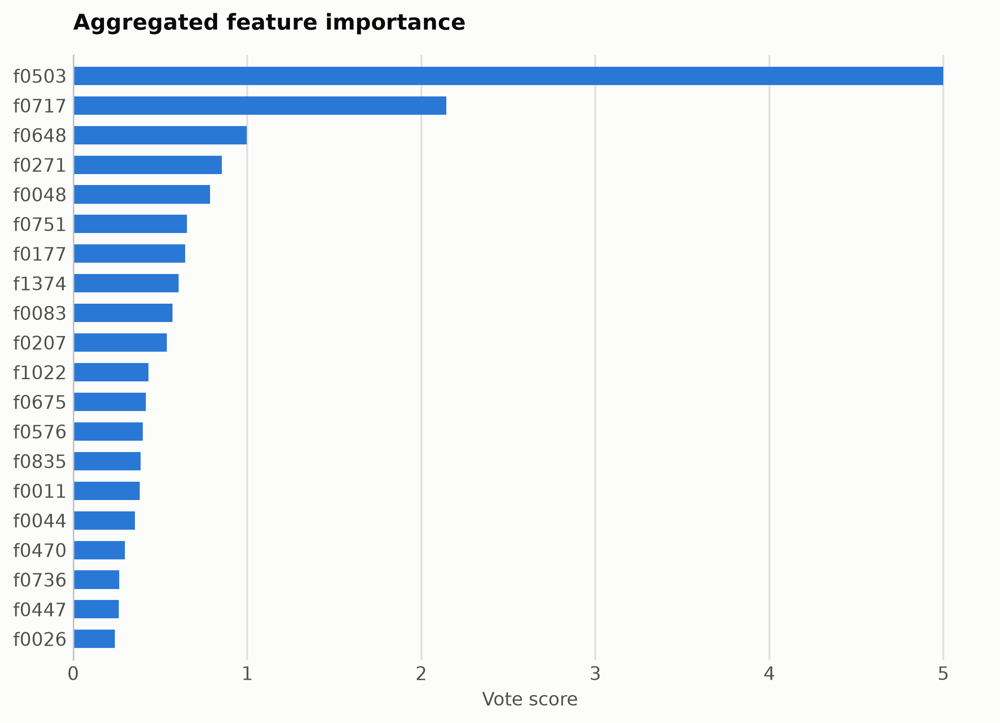
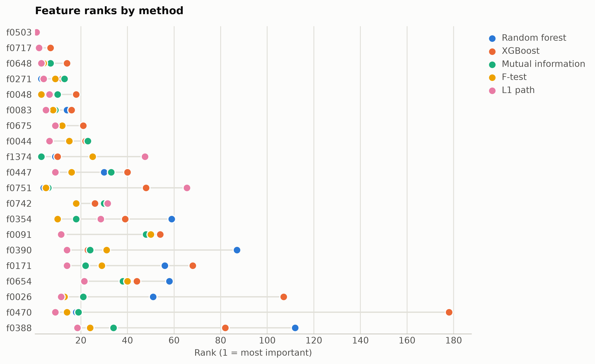

# SMS spam from ModernBERT embeddings

Binary spam detection on SMS messages. Features are mask-aware mean plus variance pooled ModernBERT-base hidden states (1,536 unnamed dimensions), ranked straight from the numpy matrix.

Data: sms_spam, 4,000 messages. 4,000 samples, 1,536 features. One five-method
ensemble ranking of the training split took 113 s and
provides every selector below; reductions fit on the same split. Three
standardized probes (accuracy: linear, kNN, RBF SVM) score the held-out
20%. Budgets anchor at the 99%-variance PCA count x = 1153, stepping
x, x/2, x/4, 10, 1.

## Consensus ranking

| feature | score |
|---|---|
| f0503 | 5 |
| f0717 | 2.143 |
| f0648 | 0.9976 |
| f0271 | 0.8547 |
| f0048 | 0.7856 |
| f0751 | 0.6528 |
| f0177 | 0.6433 |
| f1374 | 0.6055 |
| f0083 | 0.57 |
| f0207 | 0.5371 |

## Ablation: selectors vs reductions (accuracy)

`select:<method>` keeps that method's top-k raw features
(`select:vote` is the ensemble); `dr:<method>` is a fitted reduction to
the same k.

| k | representation | linear | knn | svm |
|---|---|---|---|---|
| 1536 | all features | 0.9925 | 0.9875 | 0.9912 |
| 1153 | dr:PCA | 0.9862 | 0.8612 | 0.935 |
| 1153 | dr:RandProj | 0.9912 | 0.9875 | 0.9912 |
| 1153 | select:f_test | 0.9925 | 0.9875 | 0.9912 |
| 1153 | select:l1 | 0.9938 | 0.9875 | 0.9912 |
| 1153 | select:mi | 0.9925 | 0.9875 | 0.9912 |
| 1153 | select:rf | 0.9938 | 0.9875 | 0.9912 |
| 1153 | select:vote | 0.9912 | 0.9875 | 0.9912 |
| 1153 | select:xg | 0.9925 | 0.9888 | 0.9912 |
| 576 | dr:PCA | 0.9888 | 0.8712 | 0.9825 |
| 576 | dr:RandProj | 0.9912 | 0.9862 | 0.99 |
| 576 | select:f_test | 0.9925 | 0.9875 | 0.9912 |
| 576 | select:l1 | 0.9938 | 0.9888 | 0.9912 |
| 576 | select:mi | 0.9912 | 0.9875 | 0.9912 |
| 576 | select:rf | 0.9925 | 0.9912 | 0.9912 |
| 576 | select:vote | 0.9925 | 0.9888 | 0.9912 |
| 576 | select:xg | 0.9938 | 0.99 | 0.9912 |
| 288 | dr:PCA | 0.99 | 0.965 | 0.9925 |
| 288 | dr:RandProj | 0.99 | 0.9888 | 0.99 |
| 288 | select:f_test | 0.9912 | 0.9862 | 0.9912 |
| 288 | select:l1 | 0.9912 | 0.9912 | 0.9912 |
| 288 | select:mi | 0.9912 | 0.985 | 0.99 |
| 288 | select:rf | 0.9912 | 0.9888 | 0.99 |
| 288 | select:vote | 0.9862 | 0.9888 | 0.9888 |
| 288 | select:xg | 0.9912 | 0.99 | 0.9912 |
| 10 | dr:ICA | 0.985 | 0.9862 | 0.9875 |
| 10 | dr:Isomap | 0.9888 | 0.985 | 0.99 |
| 10 | dr:KernelPCA | 0.985 | 0.9838 | 0.985 |
| 10 | dr:PCA | 0.985 | 0.9862 | 0.9875 |
| 10 | dr:RandProj | 0.9188 | 0.9288 | 0.9338 |
| 10 | dr:UMAP | 0.9875 | 0.9862 | 0.9875 |
| 10 | dr:t-SNE | 0.9288 | 0.9888 | 0.9912 |
| 10 | select:f_test | 0.9738 | 0.9775 | 0.9788 |
| 10 | select:l1 | 0.9788 | 0.98 | 0.9812 |
| 10 | select:mi | 0.9725 | 0.98 | 0.9788 |
| 10 | select:rf | 0.97 | 0.975 | 0.98 |
| 10 | select:vote | 0.9712 | 0.9825 | 0.9825 |
| 10 | select:xg | 0.9712 | 0.9812 | 0.98 |
| 1 | dr:ICA | 0.8425 | 0.8525 | 0.8612 |
| 1 | dr:Isomap | 0.8862 | 0.9312 | 0.9388 |
| 1 | dr:KernelPCA | 0.8675 | 0.8675 | 0.8612 |
| 1 | dr:PCA | 0.8425 | 0.8525 | 0.8612 |
| 1 | dr:RandProj | 0.855 | 0.8638 | 0.8612 |
| 1 | dr:UMAP | 0.8288 | 0.985 | 0.9875 |
| 1 | dr:t-SNE | 0.9638 | 0.9875 | 0.9875 |
| 1 | select:f_test | 0.9375 | 0.94 | 0.9438 |
| 1 | select:l1 | 0.9375 | 0.94 | 0.9438 |
| 1 | select:mi | 0.9375 | 0.94 | 0.9438 |
| 1 | select:rf | 0.9375 | 0.94 | 0.9438 |
| 1 | select:vote | 0.9375 | 0.94 | 0.9438 |
| 1 | select:xg | 0.9375 | 0.94 | 0.9438 |

Notes: t-SNE has no out-of-sample transform, so it is fit on all rows
(label-blind) and split afterward, which favors it mildly; UMAP, kernel
PCA, Isomap, and ICA run at budgets up to 100 and t-SNE up to
10, beyond which their cost is impractical, while selection has
no budget ceiling. Cross-dataset findings: [the research report](report.md).

Regenerate with `python examples/selection_vs_reduction.py --name modernbert_sms_spam`.
