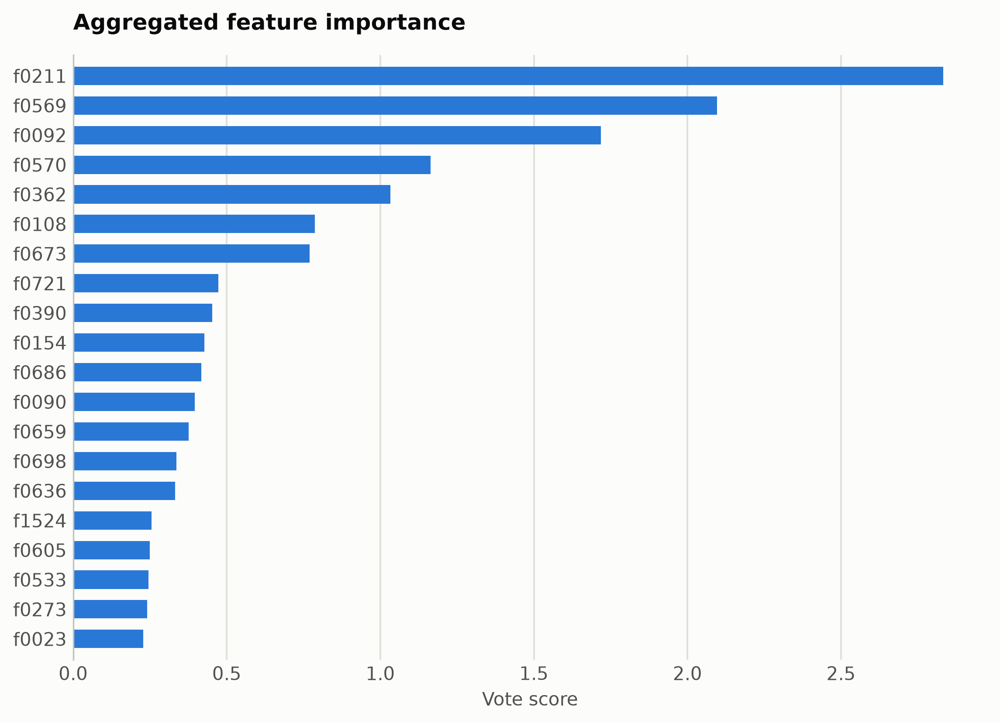
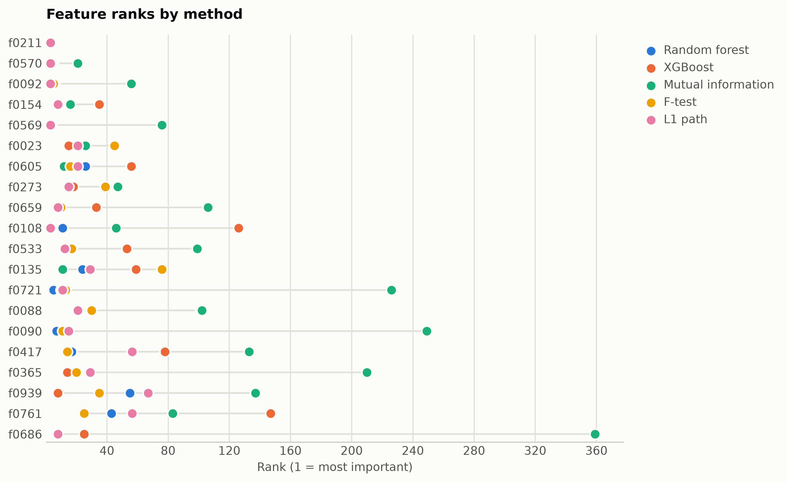

# SST-2 sentiment from ModernBERT embeddings

Binary sentiment on movie-review sentences; the deep-dive methodology page for this data is [modernbert_sentiment.md](modernbert_sentiment.md). Features are mask-aware mean plus variance pooled ModernBERT-base hidden states (1,536 unnamed dimensions), ranked straight from the numpy matrix.

Data: stanfordnlp/sst2, 4,000 sentences. 4,000 samples, 1,536 features. One five-method
ensemble ranking of the training split took 190 s and
provides every selector below; reductions fit on the same split. Three
standardized probes (accuracy: linear, kNN, RBF SVM) score the held-out
20%. Budgets anchor at the 99%-variance PCA count x = 1206, stepping
x, x/2, x/4, 10, 1.

## Consensus ranking

| feature | score |
|---|---|
| f0211 | 2.833 |
| f0569 | 2.096 |
| f0092 | 1.718 |
| f0570 | 1.164 |
| f0362 | 1.033 |
| f0108 | 0.7873 |
| f0673 | 0.7699 |
| f0721 | 0.4723 |
| f0390 | 0.4533 |
| f0154 | 0.4272 |

## Ablation: selectors vs reductions (accuracy)

`select:<method>` keeps that method's top-k raw features
(`select:vote` is the ensemble); `dr:<method>` is a fitted reduction to
the same k.

| k | representation | linear | knn | svm |
|---|---|---|---|---|
| 1536 | all features | 0.7113 | 0.66 | 0.7712 |
| 1206 | dr:PCA | 0.6925 | 0.5762 | 0.7425 |
| 1206 | dr:RandProj | 0.7088 | 0.6388 | 0.7662 |
| 1206 | select:f_test | 0.68 | 0.6562 | 0.7675 |
| 1206 | select:l1 | 0.7125 | 0.6575 | 0.7712 |
| 1206 | select:mi | 0.6988 | 0.6538 | 0.7825 |
| 1206 | select:rf | 0.7175 | 0.67 | 0.7725 |
| 1206 | select:vote | 0.7125 | 0.6612 | 0.7712 |
| 1206 | select:xg | 0.7012 | 0.66 | 0.7712 |
| 603 | dr:PCA | 0.73 | 0.6088 | 0.7562 |
| 603 | dr:RandProj | 0.73 | 0.6212 | 0.7362 |
| 603 | select:f_test | 0.7012 | 0.6625 | 0.7662 |
| 603 | select:l1 | 0.72 | 0.6675 | 0.7738 |
| 603 | select:mi | 0.7312 | 0.67 | 0.77 |
| 603 | select:rf | 0.7225 | 0.6825 | 0.7738 |
| 603 | select:vote | 0.7163 | 0.6712 | 0.7712 |
| 603 | select:xg | 0.7113 | 0.6762 | 0.7625 |
| 301 | dr:PCA | 0.7612 | 0.6512 | 0.7725 |
| 301 | dr:RandProj | 0.7325 | 0.6475 | 0.7262 |
| 301 | select:f_test | 0.73 | 0.6625 | 0.755 |
| 301 | select:l1 | 0.755 | 0.7012 | 0.7725 |
| 301 | select:mi | 0.7012 | 0.6625 | 0.745 |
| 301 | select:rf | 0.74 | 0.685 | 0.7662 |
| 301 | select:vote | 0.7388 | 0.6975 | 0.7662 |
| 301 | select:xg | 0.7362 | 0.6762 | 0.7612 |
| 10 | dr:ICA | 0.6488 | 0.5913 | 0.65 |
| 10 | dr:Isomap | 0.6088 | 0.57 | 0.615 |
| 10 | dr:KernelPCA | 0.6438 | 0.5788 | 0.63 |
| 10 | dr:PCA | 0.6488 | 0.5975 | 0.6512 |
| 10 | dr:RandProj | 0.5975 | 0.5588 | 0.5975 |
| 10 | dr:UMAP | 0.6475 | 0.5788 | 0.6438 |
| 10 | dr:t-SNE | 0.6038 | 0.5688 | 0.6338 |
| 10 | select:f_test | 0.675 | 0.6238 | 0.6688 |
| 10 | select:l1 | 0.675 | 0.6238 | 0.6688 |
| 10 | select:mi | 0.595 | 0.595 | 0.6188 |
| 10 | select:rf | 0.6662 | 0.6375 | 0.6625 |
| 10 | select:vote | 0.66 | 0.6288 | 0.6575 |
| 10 | select:xg | 0.67 | 0.61 | 0.6562 |
| 1 | dr:ICA | 0.5625 | 0.5012 | 0.555 |
| 1 | dr:Isomap | 0.565 | 0.5262 | 0.5788 |
| 1 | dr:KernelPCA | 0.5575 | 0.52 | 0.5788 |
| 1 | dr:PCA | 0.5625 | 0.5012 | 0.555 |
| 1 | dr:RandProj | 0.55 | 0.4825 | 0.5512 |
| 1 | dr:UMAP | 0.5562 | 0.5162 | 0.5738 |
| 1 | dr:t-SNE | 0.5588 | 0.5337 | 0.5638 |
| 1 | select:f_test | 0.5825 | 0.505 | 0.5888 |
| 1 | select:l1 | 0.585 | 0.525 | 0.5738 |
| 1 | select:mi | 0.5375 | 0.5188 | 0.5362 |
| 1 | select:rf | 0.585 | 0.525 | 0.5738 |
| 1 | select:vote | 0.5875 | 0.5488 | 0.585 |
| 1 | select:xg | 0.5875 | 0.5488 | 0.585 |

Notes: t-SNE has no out-of-sample transform, so it is fit on all rows
(label-blind) and split afterward, which favors it mildly; UMAP, kernel
PCA, Isomap, and ICA run at budgets up to 100 and t-SNE up to
10, beyond which their cost is impractical, while selection has
no budget ceiling. Cross-dataset findings: [the research report](report.md).

Regenerate with `python examples/selection_vs_reduction.py --name modernbert_sst2`.
