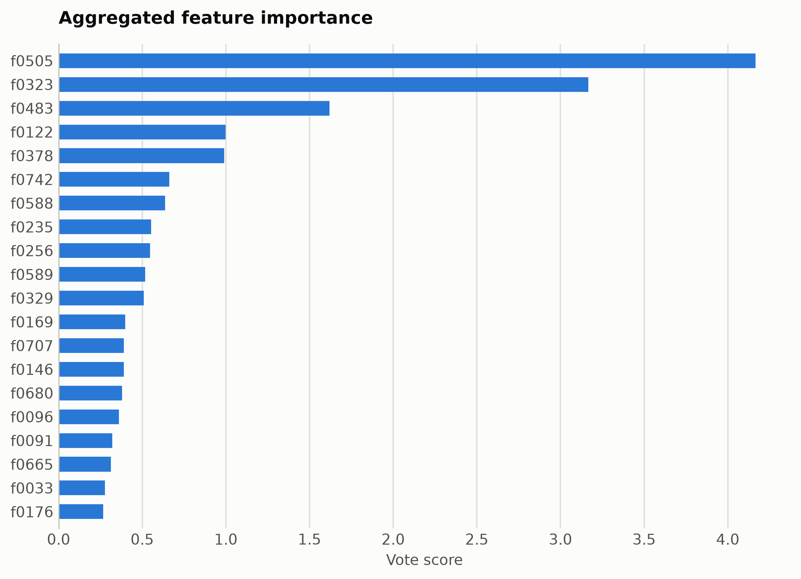
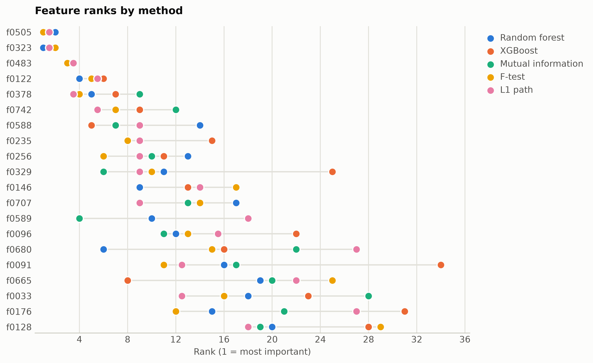

# Subjectivity from ModernBERT embeddings

Subjective vs objective sentence classification. Features are mask-aware mean plus variance pooled ModernBERT-base hidden states (1,536 unnamed dimensions), ranked straight from the numpy matrix.

Data: SetFit/subj, 4,000 sentences. 4,000 samples, 1,536 features. One five-method
ensemble ranking of the training split took 51 s and
provides every selector below; reductions fit on the same split. Three
standardized probes (accuracy: linear, kNN, RBF SVM) score the held-out
20%. Budgets anchor at the 99%-variance PCA count x = 1206, stepping
x, x/2, x/4, 10, 1.

## Consensus ranking

| feature | score |
|---|---|
| f0505 | 4.167 |
| f0323 | 3.167 |
| f0483 | 1.619 |
| f0122 | 0.9985 |
| f0378 | 0.9897 |
| f0742 | 0.662 |
| f0588 | 0.6365 |
| f0235 | 0.5528 |
| f0256 | 0.5456 |
| f0589 | 0.5167 |

## Ablation: selectors vs reductions (accuracy)

`select:<method>` keeps that method's top-k raw features
(`select:vote` is the ensemble); `dr:<method>` is a fitted reduction to
the same k.

| k | representation | linear | knn | svm |
|---|---|---|---|---|
| 1536 | all features | 0.9062 | 0.8788 | 0.9175 |
| 1206 | dr:PCA | 0.8588 | 0.6025 | 0.8762 |
| 1206 | dr:RandProj | 0.8875 | 0.88 | 0.9038 |
| 1206 | select:f_test | 0.8975 | 0.8862 | 0.92 |
| 1206 | select:l1 | 0.9112 | 0.8875 | 0.925 |
| 1206 | select:mi | 0.895 | 0.8762 | 0.915 |
| 1206 | select:rf | 0.9138 | 0.8812 | 0.9238 |
| 1206 | select:vote | 0.9125 | 0.8775 | 0.9162 |
| 1206 | select:xg | 0.9088 | 0.8838 | 0.9188 |
| 603 | dr:PCA | 0.8875 | 0.6712 | 0.9112 |
| 603 | dr:RandProj | 0.8575 | 0.88 | 0.8988 |
| 603 | select:f_test | 0.89 | 0.89 | 0.9212 |
| 603 | select:l1 | 0.9062 | 0.8838 | 0.9188 |
| 603 | select:mi | 0.8662 | 0.8975 | 0.9188 |
| 603 | select:rf | 0.8912 | 0.8825 | 0.9262 |
| 603 | select:vote | 0.8862 | 0.8988 | 0.9262 |
| 603 | select:xg | 0.8938 | 0.8938 | 0.9212 |
| 301 | dr:PCA | 0.9162 | 0.7712 | 0.93 |
| 301 | dr:RandProj | 0.87 | 0.8588 | 0.8788 |
| 301 | select:f_test | 0.8975 | 0.8975 | 0.9138 |
| 301 | select:l1 | 0.8912 | 0.8988 | 0.9262 |
| 301 | select:mi | 0.8962 | 0.8875 | 0.9125 |
| 301 | select:rf | 0.9062 | 0.8912 | 0.9125 |
| 301 | select:vote | 0.9062 | 0.8912 | 0.9212 |
| 301 | select:xg | 0.89 | 0.895 | 0.9238 |
| 10 | dr:ICA | 0.885 | 0.865 | 0.89 |
| 10 | dr:Isomap | 0.845 | 0.8288 | 0.8562 |
| 10 | dr:KernelPCA | 0.8762 | 0.8688 | 0.8862 |
| 10 | dr:PCA | 0.885 | 0.8688 | 0.89 |
| 10 | dr:RandProj | 0.675 | 0.62 | 0.6838 |
| 10 | dr:UMAP | 0.8712 | 0.8512 | 0.87 |
| 10 | dr:t-SNE | 0.8175 | 0.8088 | 0.8162 |
| 10 | select:f_test | 0.8388 | 0.8175 | 0.8375 |
| 10 | select:l1 | 0.8388 | 0.8175 | 0.8375 |
| 10 | select:mi | 0.8338 | 0.8088 | 0.8325 |
| 10 | select:rf | 0.84 | 0.8238 | 0.8312 |
| 10 | select:vote | 0.835 | 0.81 | 0.8375 |
| 10 | select:xg | 0.8288 | 0.815 | 0.8362 |
| 1 | dr:ICA | 0.5 | 0.485 | 0.4988 |
| 1 | dr:Isomap | 0.76 | 0.7312 | 0.75 |
| 1 | dr:KernelPCA | 0.5325 | 0.4888 | 0.54 |
| 1 | dr:PCA | 0.5 | 0.485 | 0.4975 |
| 1 | dr:RandProj | 0.5375 | 0.5138 | 0.5412 |
| 1 | dr:UMAP | 0.6562 | 0.6925 | 0.6862 |
| 1 | dr:t-SNE | 0.6138 | 0.6688 | 0.6912 |
| 1 | select:f_test | 0.6825 | 0.6438 | 0.68 |
| 1 | select:l1 | 0.6925 | 0.6712 | 0.695 |
| 1 | select:mi | 0.6825 | 0.6438 | 0.68 |
| 1 | select:rf | 0.6925 | 0.6712 | 0.695 |
| 1 | select:vote | 0.6825 | 0.6438 | 0.68 |
| 1 | select:xg | 0.6825 | 0.6438 | 0.68 |

Notes: t-SNE has no out-of-sample transform, so it is fit on all rows
(label-blind) and split afterward, which favors it mildly; UMAP, kernel
PCA, Isomap, and ICA run at budgets up to 100 and t-SNE up to
10, beyond which their cost is impractical, while selection has
no budget ceiling. Cross-dataset findings: [the research report](report.md).

Regenerate with `python examples/selection_vs_reduction.py --name modernbert_subjectivity`.
