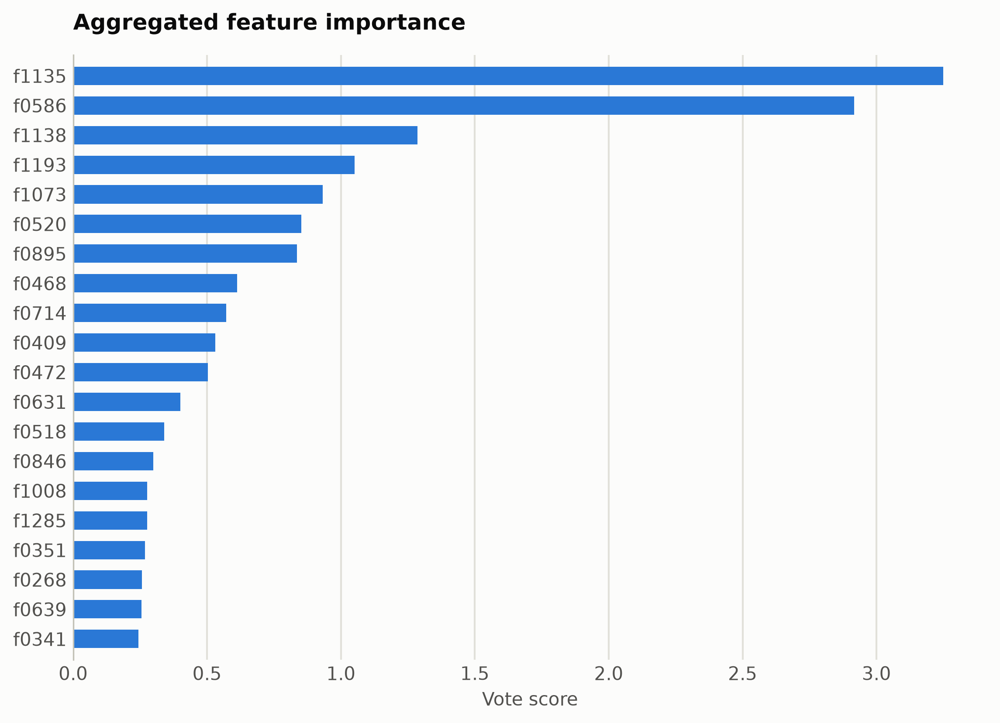
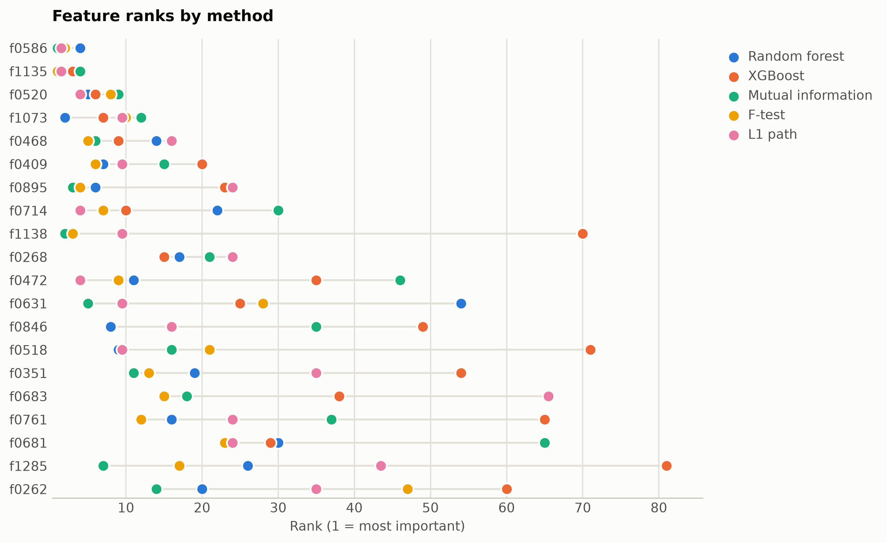

# TREC question types from ModernBERT embeddings

Six-way question-type classification of short questions. Features are mask-aware mean plus variance pooled ModernBERT-base hidden states (1,536 unnamed dimensions), ranked straight from the numpy matrix.

Data: trec, 4,000 questions. 4,000 samples, 1,536 features. One five-method
ensemble ranking of the training split took 2485 s and
provides every selector below; reductions fit on the same split. Three
standardized probes (accuracy: linear, kNN, RBF SVM) score the held-out
20%. Budgets anchor at the 99%-variance PCA count x = 1198, stepping
x, x/2, x/4, 10, 1.

## Consensus ranking

| feature | score |
|---|---|
| f1135 | 3.25 |
| f0586 | 2.917 |
| f1138 | 1.286 |
| f1193 | 1.051 |
| f1073 | 0.9315 |
| f0520 | 0.8528 |
| f0895 | 0.8351 |
| f0468 | 0.6117 |
| f0714 | 0.5716 |
| f0409 | 0.5315 |

## Ablation: selectors vs reductions (accuracy)

`select:<method>` keeps that method's top-k raw features
(`select:vote` is the ensemble); `dr:<method>` is a fitted reduction to
the same k.

| k | representation | linear | knn | svm |
|---|---|---|---|---|
| 1536 | all features | 0.8762 | 0.7525 | 0.8788 |
| 1198 | dr:PCA | 0.8138 | 0.2388 | 0.6562 |
| 1198 | dr:RandProj | 0.8412 | 0.7338 | 0.87 |
| 1198 | select:f_test | 0.8638 | 0.7562 | 0.8725 |
| 1198 | select:l1 | 0.8788 | 0.7462 | 0.8725 |
| 1198 | select:mi | 0.8575 | 0.7575 | 0.8725 |
| 1198 | select:rf | 0.855 | 0.7575 | 0.8762 |
| 1198 | select:vote | 0.8562 | 0.7512 | 0.8725 |
| 1198 | select:xg | 0.87 | 0.7512 | 0.8788 |
| 599 | dr:PCA | 0.8188 | 0.2925 | 0.8625 |
| 599 | dr:RandProj | 0.8062 | 0.7312 | 0.8488 |
| 599 | select:f_test | 0.8038 | 0.7575 | 0.8675 |
| 599 | select:l1 | 0.8612 | 0.7612 | 0.8838 |
| 599 | select:mi | 0.815 | 0.7712 | 0.8688 |
| 599 | select:rf | 0.8225 | 0.76 | 0.8738 |
| 599 | select:vote | 0.8312 | 0.7675 | 0.8725 |
| 599 | select:xg | 0.84 | 0.7662 | 0.8638 |
| 299 | dr:PCA | 0.8462 | 0.5638 | 0.8762 |
| 299 | dr:RandProj | 0.7425 | 0.715 | 0.8175 |
| 299 | select:f_test | 0.7612 | 0.755 | 0.8338 |
| 299 | select:l1 | 0.8038 | 0.765 | 0.8675 |
| 299 | select:mi | 0.7862 | 0.76 | 0.85 |
| 299 | select:rf | 0.7825 | 0.7638 | 0.8438 |
| 299 | select:vote | 0.79 | 0.7662 | 0.8538 |
| 299 | select:xg | 0.785 | 0.7612 | 0.8388 |
| 10 | dr:ICA | 0.6188 | 0.6412 | 0.6612 |
| 10 | dr:Isomap | 0.6312 | 0.6438 | 0.6725 |
| 10 | dr:KernelPCA | 0.6312 | 0.64 | 0.6712 |
| 10 | dr:PCA | 0.6212 | 0.6438 | 0.6625 |
| 10 | dr:RandProj | 0.405 | 0.3738 | 0.4338 |
| 10 | dr:UMAP | 0.6338 | 0.6475 | 0.6362 |
| 10 | dr:t-SNE | 0.52 | 0.695 | 0.6562 |
| 10 | select:f_test | 0.535 | 0.5275 | 0.5838 |
| 10 | select:l1 | 0.5125 | 0.52 | 0.5387 |
| 10 | select:mi | 0.4825 | 0.5188 | 0.5337 |
| 10 | select:rf | 0.5412 | 0.545 | 0.5812 |
| 10 | select:vote | 0.535 | 0.5325 | 0.57 |
| 10 | select:xg | 0.4888 | 0.4912 | 0.5238 |
| 1 | dr:ICA | 0.3012 | 0.2375 | 0.3 |
| 1 | dr:Isomap | 0.3475 | 0.3375 | 0.3662 |
| 1 | dr:KernelPCA | 0.2925 | 0.27 | 0.3012 |
| 1 | dr:PCA | 0.3012 | 0.2375 | 0.3 |
| 1 | dr:RandProj | 0.26 | 0.2162 | 0.2638 |
| 1 | dr:UMAP | 0.3312 | 0.5925 | 0.5412 |
| 1 | dr:t-SNE | 0.3775 | 0.4975 | 0.4712 |
| 1 | select:f_test | 0.2938 | 0.275 | 0.3 |
| 1 | select:l1 | 0.33 | 0.2825 | 0.3212 |
| 1 | select:mi | 0.33 | 0.2825 | 0.3212 |
| 1 | select:rf | 0.2938 | 0.275 | 0.3 |
| 1 | select:vote | 0.2938 | 0.275 | 0.3 |
| 1 | select:xg | 0.2338 | 0.2212 | 0.2812 |

Notes: t-SNE has no out-of-sample transform, so it is fit on all rows
(label-blind) and split afterward, which favors it mildly; UMAP, kernel
PCA, Isomap, and ICA run at budgets up to 100 and t-SNE up to
10, beyond which their cost is impractical, while selection has
no budget ceiling. Cross-dataset findings: [the research report](report.md).

Regenerate with `python examples/selection_vs_reduction.py --name modernbert_trec`.
