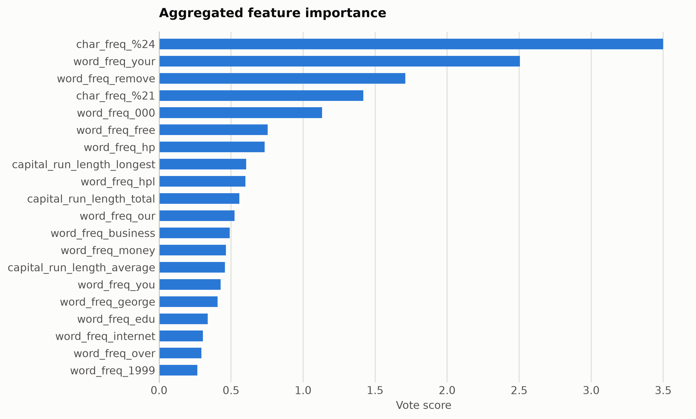
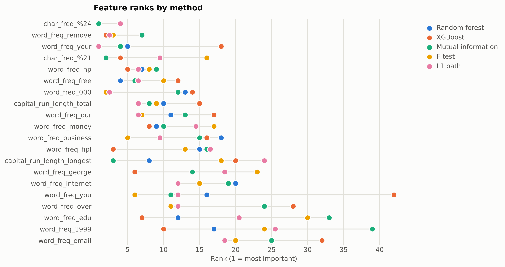

# Spambase engineered email features

Hand-engineered email features from 1999: word and character frequencies plus capital-run statistics. Classical feature engineering, fully named and interpretable.

Data: OpenML spambase (id 44), 4,601 emails, 57 features. 4,601 samples, 57 features. One five-method
ensemble ranking of the training split took 17 s and
provides every selector below; reductions fit on the same split. Three
standardized probes (accuracy: linear, kNN, RBF SVM) score the held-out
20%. Budgets anchor at the 99%-variance PCA count x = 54, stepping
x, x/2, x/4, 10, 1.

## Consensus ranking

| feature | score |
|---|---|
| char_freq_%24 | 3.5 |
| word_freq_your | 2.506 |
| word_freq_remove | 1.71 |
| char_freq_%21 | 1.418 |
| word_freq_000 | 1.132 |
| word_freq_free | 0.7538 |
| word_freq_hp | 0.7328 |
| capital_run_length_longest | 0.6056 |
| word_freq_hpl | 0.6 |
| capital_run_length_total | 0.5566 |

## Ablation: selectors vs reductions (accuracy)

`select:<method>` keeps that method's top-k raw features
(`select:vote` is the ensemble); `dr:<method>` is a fitted reduction to
the same k.

| k | representation | linear | knn | svm |
|---|---|---|---|---|
| 57 | all features | 0.9294 | 0.9034 | 0.9273 |
| 54 | dr:ICA | 0.9273 | 0.8817 | 0.9251 |
| 54 | dr:Isomap | 0.8795 | 0.8686 | 0.8969 |
| 54 | dr:KernelPCA | 0.9164 | 0.8827 | 0.9164 |
| 54 | dr:PCA | 0.9273 | 0.8817 | 0.9251 |
| 54 | dr:RandProj | 0.9229 | 0.8936 | 0.9175 |
| 54 | dr:UMAP | 0.8664 | 0.8882 | 0.8817 |
| 54 | select:f_test | 0.9316 | 0.8925 | 0.924 |
| 54 | select:l1 | 0.9294 | 0.9099 | 0.9273 |
| 54 | select:mi | 0.9294 | 0.9066 | 0.924 |
| 54 | select:rf | 0.9273 | 0.9034 | 0.924 |
| 54 | select:vote | 0.9273 | 0.9034 | 0.924 |
| 54 | select:xg | 0.9294 | 0.9001 | 0.9251 |
| 27 | dr:ICA | 0.9023 | 0.8925 | 0.9175 |
| 27 | dr:Isomap | 0.874 | 0.8827 | 0.8871 |
| 27 | dr:KernelPCA | 0.9099 | 0.8719 | 0.911 |
| 27 | dr:PCA | 0.9023 | 0.8925 | 0.9175 |
| 27 | dr:RandProj | 0.8328 | 0.8849 | 0.8882 |
| 27 | dr:UMAP | 0.8643 | 0.8882 | 0.8827 |
| 27 | select:f_test | 0.9023 | 0.8806 | 0.9164 |
| 27 | select:l1 | 0.9218 | 0.8914 | 0.9197 |
| 27 | select:mi | 0.9034 | 0.8893 | 0.9218 |
| 27 | select:rf | 0.924 | 0.911 | 0.9262 |
| 27 | select:vote | 0.9197 | 0.9055 | 0.924 |
| 27 | select:xg | 0.9186 | 0.9175 | 0.9197 |
| 13 | dr:ICA | 0.9001 | 0.9034 | 0.911 |
| 13 | dr:Isomap | 0.8621 | 0.8806 | 0.874 |
| 13 | dr:KernelPCA | 0.8817 | 0.8817 | 0.8947 |
| 13 | dr:PCA | 0.9001 | 0.9034 | 0.911 |
| 13 | dr:RandProj | 0.7622 | 0.861 | 0.8371 |
| 13 | dr:UMAP | 0.8599 | 0.899 | 0.8806 |
| 13 | select:f_test | 0.8762 | 0.8903 | 0.8979 |
| 13 | select:l1 | 0.8882 | 0.9088 | 0.9142 |
| 13 | select:mi | 0.8979 | 0.8958 | 0.9142 |
| 13 | select:rf | 0.9045 | 0.9077 | 0.9153 |
| 13 | select:vote | 0.9001 | 0.911 | 0.9153 |
| 13 | select:xg | 0.9023 | 0.9099 | 0.9066 |
| 10 | dr:ICA | 0.8969 | 0.899 | 0.9077 |
| 10 | dr:Isomap | 0.8578 | 0.8762 | 0.873 |
| 10 | dr:KernelPCA | 0.8827 | 0.8784 | 0.8969 |
| 10 | dr:PCA | 0.8969 | 0.899 | 0.9077 |
| 10 | dr:RandProj | 0.7655 | 0.8415 | 0.8252 |
| 10 | dr:UMAP | 0.8654 | 0.8979 | 0.8849 |
| 10 | dr:t-SNE | 0.8806 | 0.9001 | 0.886 |
| 10 | select:f_test | 0.8762 | 0.8936 | 0.8925 |
| 10 | select:l1 | 0.8827 | 0.9012 | 0.9099 |
| 10 | select:mi | 0.8882 | 0.8936 | 0.9023 |
| 10 | select:rf | 0.8882 | 0.8936 | 0.9023 |
| 10 | select:vote | 0.8903 | 0.8882 | 0.9045 |
| 10 | select:xg | 0.8795 | 0.9055 | 0.8947 |
| 1 | dr:ICA | 0.8447 | 0.8502 | 0.8447 |
| 1 | dr:Isomap | 0.8328 | 0.8284 | 0.8187 |
| 1 | dr:KernelPCA | 0.6059 | 0.6135 | 0.6059 |
| 1 | dr:PCA | 0.8447 | 0.8502 | 0.8458 |
| 1 | dr:RandProj | 0.608 | 0.6211 | 0.6124 |
| 1 | dr:UMAP | 0.5983 | 0.8382 | 0.7535 |
| 1 | dr:t-SNE | 0.8219 | 0.8469 | 0.8306 |
| 1 | select:f_test | 0.6982 | 0.7286 | 0.7438 |
| 1 | select:l1 | 0.6982 | 0.7286 | 0.7438 |
| 1 | select:mi | 0.76 | 0.7709 | 0.7709 |
| 1 | select:rf | 0.76 | 0.7709 | 0.7709 |
| 1 | select:vote | 0.76 | 0.7709 | 0.7709 |
| 1 | select:xg | 0.76 | 0.7709 | 0.7709 |

Notes: t-SNE has no out-of-sample transform, so it is fit on all rows
(label-blind) and split afterward, which favors it mildly; UMAP, kernel
PCA, Isomap, and ICA run at budgets up to 100 and t-SNE up to
10, beyond which their cost is impractical, while selection has
no budget ceiling. Cross-dataset findings: [the research report](report.md).

Regenerate with `python examples/selection_vs_reduction.py --name spambase_engineered`.
