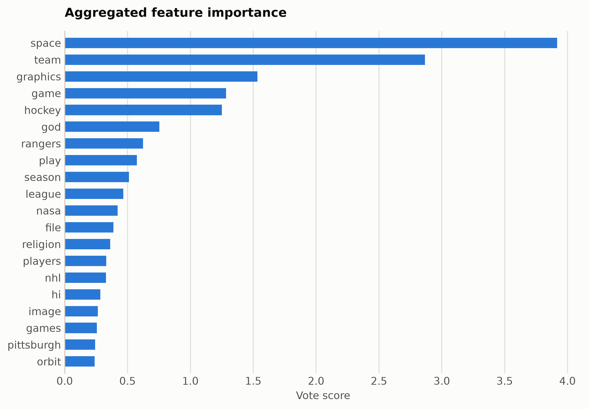
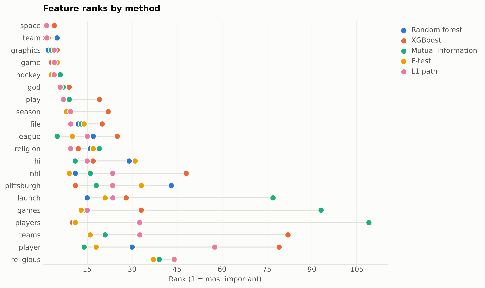

# 20 Newsgroups from TF-IDF words

Four newsgroups (atheism, graphics, hockey, space) as word-level TF-IDF with headers, footers, and quotes stripped; ranked features are topic vocabulary.

Data: fetch_20newsgroups train subset, 4 categories. 2,257 samples, 2,000 features. One five-method
ensemble ranking of the training split took 1258 s and
provides every selector below; reductions fit on the same split. Three
standardized probes (accuracy: linear, kNN, RBF SVM) score the held-out
20%. Budgets anchor at the 99%-variance PCA count x = 1392, stepping
x, x/2, x/4, 10, 1.

## Consensus ranking

| feature | score |
|---|---|
| space | 3.917 |
| team | 2.867 |
| graphics | 1.533 |
| game | 1.283 |
| hockey | 1.25 |
| god | 0.754 |
| rangers | 0.6239 |
| play | 0.5745 |
| season | 0.5118 |
| league | 0.4655 |

## Ablation: selectors vs reductions (accuracy)

`select:<method>` keeps that method's top-k raw features
(`select:vote` is the ensemble); `dr:<method>` is a fitted reduction to
the same k.

| k | representation | linear | knn | svm |
|---|---|---|---|---|
| 2000 | all features | 0.8341 | 0.2412 | 0.7721 |
| 1392 | dr:PCA | 0.6991 | 0.2301 | 0.4425 |
| 1392 | dr:RandProj | 0.7434 | 0.2434 | 0.7235 |
| 1392 | select:f_test | 0.8451 | 0.2987 | 0.8208 |
| 1392 | select:l1 | 0.8341 | 0.2699 | 0.8208 |
| 1392 | select:mi | 0.8053 | 0.3296 | 0.8009 |
| 1392 | select:rf | 0.8296 | 0.2522 | 0.7987 |
| 1392 | select:vote | 0.8473 | 0.2588 | 0.8451 |
| 1392 | select:xg | 0.8164 | 0.2788 | 0.781 |
| 696 | dr:PCA | 0.792 | 0.2389 | 0.7942 |
| 696 | dr:RandProj | 0.7035 | 0.2522 | 0.7168 |
| 696 | select:f_test | 0.823 | 0.6261 | 0.8496 |
| 696 | select:l1 | 0.8363 | 0.4403 | 0.8363 |
| 696 | select:mi | 0.7854 | 0.531 | 0.8009 |
| 696 | select:rf | 0.8186 | 0.3518 | 0.8363 |
| 696 | select:vote | 0.8296 | 0.4204 | 0.8341 |
| 696 | select:xg | 0.8252 | 0.4292 | 0.8142 |
| 348 | dr:PCA | 0.8208 | 0.2876 | 0.8429 |
| 348 | dr:RandProj | 0.5951 | 0.2611 | 0.6792 |
| 348 | select:f_test | 0.8363 | 0.646 | 0.8186 |
| 348 | select:l1 | 0.8429 | 0.7058 | 0.8628 |
| 348 | select:mi | 0.7389 | 0.6438 | 0.7478 |
| 348 | select:rf | 0.8075 | 0.6704 | 0.8473 |
| 348 | select:vote | 0.8208 | 0.6925 | 0.8451 |
| 348 | select:xg | 0.8186 | 0.6881 | 0.8451 |
| 10 | dr:ICA | 0.8628 | 0.8496 | 0.8429 |
| 10 | dr:Isomap | 0.3584 | 0.3341 | 0.3429 |
| 10 | dr:KernelPCA | 0.8341 | 0.8031 | 0.8186 |
| 10 | dr:PCA | 0.8562 | 0.8274 | 0.8496 |
| 10 | dr:RandProj | 0.365 | 0.3429 | 0.3628 |
| 10 | dr:UMAP | 0.2699 | 0.219 | 0.2765 |
| 10 | dr:t-SNE | 0.354 | 0.354 | 0.4004 |
| 10 | select:f_test | 0.5619 | 0.5376 | 0.5686 |
| 10 | select:l1 | 0.5774 | 0.5796 | 0.5752 |
| 10 | select:mi | 0.5642 | 0.5354 | 0.5664 |
| 10 | select:rf | 0.5708 | 0.5354 | 0.573 |
| 10 | select:vote | 0.573 | 0.5465 | 0.5774 |
| 10 | select:xg | 0.5708 | 0.5288 | 0.5686 |
| 1 | dr:ICA | 0.4115 | 0.4159 | 0.4624 |
| 1 | dr:Isomap | 0.3097 | 0.2854 | 0.3208 |
| 1 | dr:KernelPCA | 0.323 | 0.2743 | 0.3208 |
| 1 | dr:PCA | 0.4115 | 0.4115 | 0.4624 |
| 1 | dr:RandProj | 0.2721 | 0.2478 | 0.3164 |
| 1 | dr:UMAP | 0.2655 | 0.2677 | 0.2478 |
| 1 | dr:t-SNE | 0.2898 | 0.3385 | 0.3009 |
| 1 | select:f_test | 0.3606 | 0.2633 | 0.3606 |
| 1 | select:l1 | 0.3606 | 0.2633 | 0.3606 |
| 1 | select:mi | 0.3606 | 0.2633 | 0.3606 |
| 1 | select:rf | 0.3606 | 0.2633 | 0.3606 |
| 1 | select:vote | 0.3606 | 0.2633 | 0.3606 |
| 1 | select:xg | 0.3341 | 0.3274 | 0.3296 |

Notes: t-SNE has no out-of-sample transform, so it is fit on all rows
(label-blind) and split afterward, which favors it mildly; UMAP, kernel
PCA, Isomap, and ICA run at budgets up to 100 and t-SNE up to
10, beyond which their cost is impractical, while selection has
no budget ceiling. Cross-dataset findings: [the research report](report.md).

Regenerate with `python examples/selection_vs_reduction.py --name tfidf_newsgroups`.
