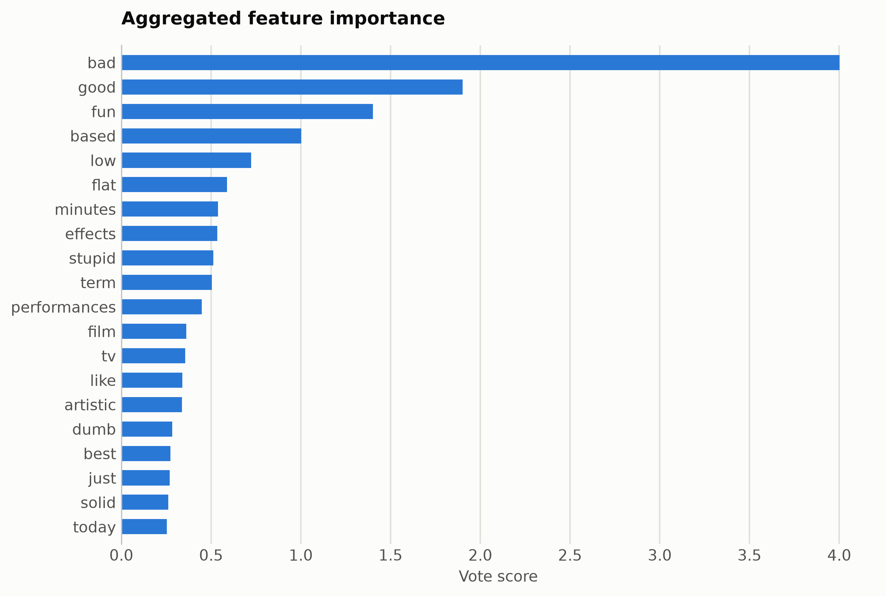
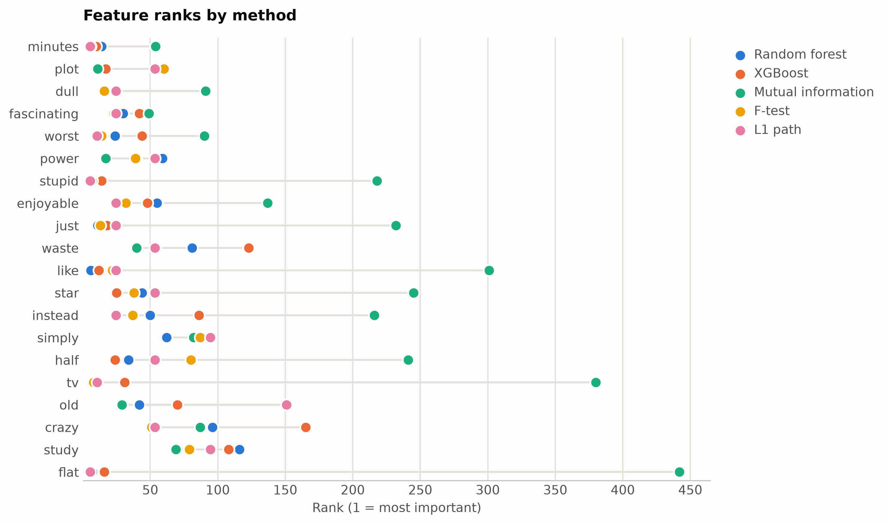

# SST-2 sentiment from TF-IDF words

Word-level TF-IDF (top 2,000 terms), so every ranked feature is a literal word and the consensus plot reads as a vocabulary of sentiment.

Data: stanfordnlp/sst2, 4,000 sentences. 4,000 samples, 1,774 features. One five-method
ensemble ranking of the training split took 18 s and
provides every selector below; reductions fit on the same split. Three
standardized probes (accuracy: linear, kNN, RBF SVM) score the held-out
20%. Budgets anchor at the 99%-variance PCA count x = 1541, stepping
x, x/2, x/4, 10, 1.

## Consensus ranking

| feature | score |
|---|---|
| bad | 4.001 |
| good | 1.901 |
| fun | 1.401 |
| based | 1.003 |
| low | 0.7235 |
| flat | 0.5894 |
| minutes | 0.5384 |
| effects | 0.534 |
| stupid | 0.5118 |
| term | 0.5049 |

## Ablation: selectors vs reductions (accuracy)

`select:<method>` keeps that method's top-k raw features
(`select:vote` is the ensemble); `dr:<method>` is a fitted reduction to
the same k.

| k | representation | linear | knn | svm |
|---|---|---|---|---|
| 1774 | all features | 0.6662 | 0.5775 | 0.69 |
| 1541 | dr:PCA | 0.6575 | 0.6075 | 0.67 |
| 1541 | dr:RandProj | 0.6475 | 0.5725 | 0.7 |
| 1541 | select:f_test | 0.6662 | 0.6637 | 0.695 |
| 1541 | select:l1 | 0.67 | 0.645 | 0.6925 |
| 1541 | select:mi | 0.6675 | 0.5488 | 0.67 |
| 1541 | select:rf | 0.6662 | 0.5962 | 0.6825 |
| 1541 | select:vote | 0.6775 | 0.565 | 0.6912 |
| 1541 | select:xg | 0.6675 | 0.525 | 0.675 |
| 770 | dr:PCA | 0.6962 | 0.605 | 0.6912 |
| 770 | dr:RandProj | 0.6637 | 0.595 | 0.6912 |
| 770 | select:f_test | 0.6962 | 0.6188 | 0.6988 |
| 770 | select:l1 | 0.7088 | 0.6388 | 0.6962 |
| 770 | select:mi | 0.6525 | 0.5262 | 0.6425 |
| 770 | select:rf | 0.6862 | 0.62 | 0.6775 |
| 770 | select:vote | 0.67 | 0.615 | 0.6612 |
| 770 | select:xg | 0.6525 | 0.6462 | 0.6438 |
| 385 | dr:PCA | 0.6475 | 0.63 | 0.6812 |
| 385 | dr:RandProj | 0.6188 | 0.59 | 0.6912 |
| 385 | select:f_test | 0.6712 | 0.665 | 0.67 |
| 385 | select:l1 | 0.68 | 0.6662 | 0.6625 |
| 385 | select:mi | 0.6012 | 0.5262 | 0.5925 |
| 385 | select:rf | 0.6587 | 0.6112 | 0.6562 |
| 385 | select:vote | 0.6425 | 0.5925 | 0.6475 |
| 385 | select:xg | 0.6488 | 0.6162 | 0.6612 |
| 10 | dr:ICA | 0.56 | 0.5662 | 0.565 |
| 10 | dr:Isomap | 0.5612 | 0.5525 | 0.5588 |
| 10 | dr:KernelPCA | 0.5538 | 0.545 | 0.56 |
| 10 | dr:PCA | 0.56 | 0.5962 | 0.5575 |
| 10 | dr:RandProj | 0.5387 | 0.5788 | 0.5825 |
| 10 | dr:UMAP | 0.5 | 0.5475 | 0.5375 |
| 10 | dr:t-SNE | 0.55 | 0.6 | 0.5675 |
| 10 | select:f_test | 0.565 | 0.4625 | 0.5638 |
| 10 | select:l1 | 0.5638 | 0.4675 | 0.5625 |
| 10 | select:mi | 0.5475 | 0.4562 | 0.5488 |
| 10 | select:rf | 0.5638 | 0.47 | 0.56 |
| 10 | select:vote | 0.5625 | 0.4638 | 0.5612 |
| 10 | select:xg | 0.565 | 0.4738 | 0.5662 |
| 1 | dr:ICA | 0.5488 | 0.5225 | 0.5475 |
| 1 | dr:Isomap | 0.5475 | 0.5138 | 0.5488 |
| 1 | dr:KernelPCA | 0.5488 | 0.5375 | 0.5488 |
| 1 | dr:PCA | 0.5488 | 0.5212 | 0.5475 |
| 1 | dr:RandProj | 0.5475 | 0.5162 | 0.5375 |
| 1 | dr:UMAP | 0.5488 | 0.4788 | 0.5488 |
| 1 | dr:t-SNE | 0.5488 | 0.5288 | 0.5488 |
| 1 | select:f_test | 0.5575 | 0.4512 | 0.5575 |
| 1 | select:l1 | 0.5575 | 0.4512 | 0.5575 |
| 1 | select:mi | 0.5475 | 0.4525 | 0.5475 |
| 1 | select:rf | 0.5575 | 0.4512 | 0.5575 |
| 1 | select:vote | 0.5575 | 0.4512 | 0.5575 |
| 1 | select:xg | 0.5575 | 0.4512 | 0.5575 |

Notes: t-SNE has no out-of-sample transform, so it is fit on all rows
(label-blind) and split afterward, which favors it mildly; UMAP, kernel
PCA, Isomap, and ICA run at budgets up to 100 and t-SNE up to
10, beyond which their cost is impractical, while selection has
no budget ceiling. Cross-dataset findings: [the research report](report.md).

Regenerate with `python examples/selection_vs_reduction.py --name tfidf_sst2`.
